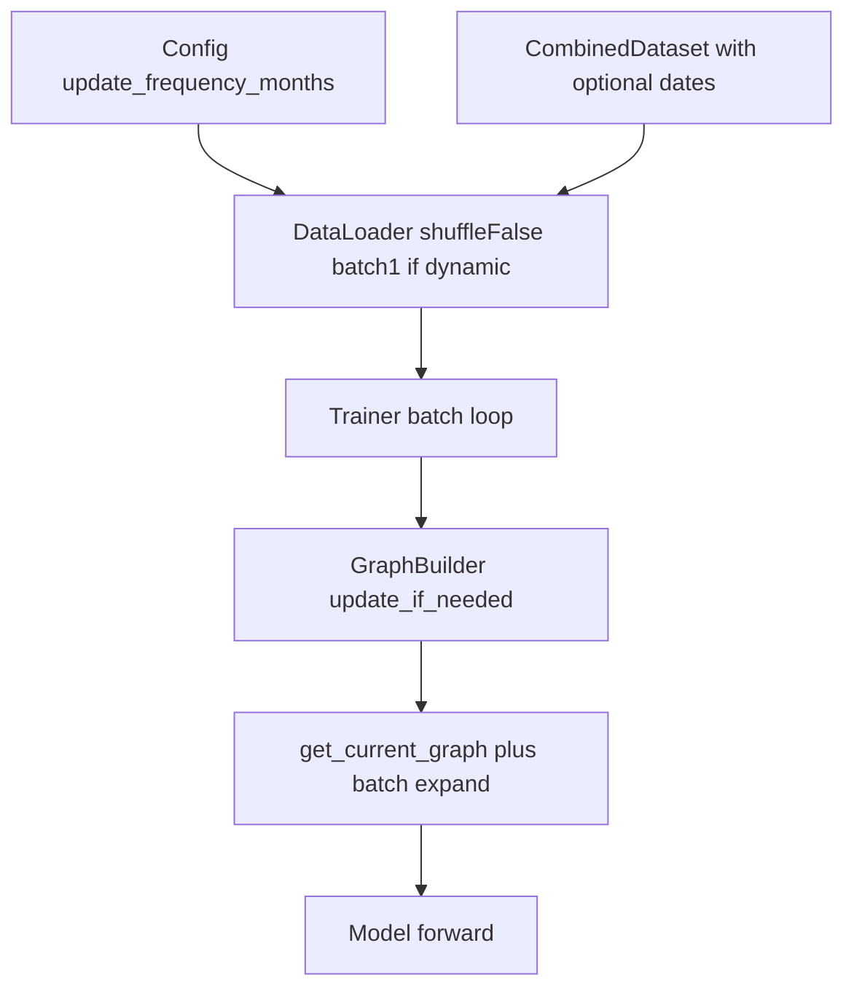

# Implement dynamic graph wiring (training pipeline)

## Current gaps (verified)

- [`mci_gru/training/trainer.py`](mci_gru/training/trainer.py): Updates use `train_dates[epoch % len(train_dates)]` and run once per epoch; `_update_graph` sets `Trainer.current_edge_*` but `_train_epoch` / `_validate` / `predict` still pass **loader** `edge_index`/`edge_weight` (static from [`combined_collate_fn`](mci_gru/data/data_manager.py)).
- [`mci_gru/data/data_manager.py`](mci_gru/data/data_manager.py): `CombinedDataset` has no dates; train `DataLoader` always `shuffle=True`; collate binds fixed edges via `partial(combined_collate_fn, edge_index=..., edge_weight=...)`.
- [`run_experiment.py`](run_experiment.py): Does not pass date lists into `create_data_loaders`.
- No [`tests/test_dynamic_graph_updates.py`](tests/test_dynamic_graph_updates.py).

[`GraphBuilder`](mci_gru/graph/builder.py) already implements causal correlation (`df['dt'] < end_date`), `should_update` / `update_if_needed`, and `get_current_graph()` — treat it as the **single source of truth** for edge tensors after each update (avoid duplicating state on `Trainer` beyond a thin cache if needed for tests).

## Design choices

### 1) One date per forward (avoid lookahead within a batch)

Training tensors are **one row per calendar day** (batch dimension = days). With `batch_size > 1` and `shuffle=False`, a batch still contains **multiple different dates**, so a single “graph for the batch” would leak future information unless you sub-batch.

**Recommendation:** When `graph.update_frequency_months > 0`, enforce **train `batch_size = 1`** (clamp in [`create_data_loaders`](mci_gru/data/data_manager.py) or validate in [`ExperimentConfig`](mci_gru/config.py) / startup in `run_experiment.py` with a clear log message). Keep val/test as `shuffle=False`; use **`batch_size = 1` for train and val** when dynamic updates are on (test is already batch 1). This matches the original plan’s “monotonic progression” without an inner micro-loop over batch rows.

### 2) Where updates run

- Remove per-epoch `_should_update_graph` / `_update_graph` calls from [`Trainer.train`](mci_gru/training/trainer.py).
- At the **start of each batch** (train / val / test): read the batch date(s), call `graph_builder.update_if_needed(df, kdcode_list, batch_date)` (for train+val+test predict loops), then build batched edge tensors from `graph_builder.get_current_graph()` and pass those to `model(...)`.

Use the **batch’s trading date** as `current_date` (with batch_size 1 this is a single string).

### 3) Val / test graph state

After training, `GraphBuilder.last_update_date` reflects the last training date. For validation and test, **continue** calling `update_if_needed` per batch date so the graph advances correctly across val/test (same `df` and `kdcode_list` as today). No separate “reset” unless you add an explicit API (not required if val/test dates are strictly after train and monotonic).

### 4) Static / backward compatibility

When `update_frequency_months == 0`: keep current behavior — static edges from collate, `shuffle=True` for train, existing batch sizes. Do **not** require dates in collate for this path (optional `None` dates → collate unchanged).

## Implementation steps

### A. Dataset and collate ([`mci_gru/data/data_manager.py`](mci_gru/data/data_manager.py))

- Extend `CombinedDataset.__init__` with optional `sample_dates: Optional[List[str]]` (same length as dataset).
- `__getitem__` returns `sample_dates[idx]` when provided (e.g. as `batch_date` string or alongside existing dict keys — keep tensor shapes unchanged).
- Extend `combined_collate_fn` to accept optional per-sample dates:
  - If dates present: stack or return a tuple/list of date strings aligned with batch (length `batch_size`).
  - Return signature becomes: existing tensors **plus** optional `batch_dates` (or `None`).
- Update `create_data_loaders(...)`:
  - New parameters: `train_dates`, `val_dates`, `test_dates` (lists aligned 1:1 with samples), and `dynamic_graph: bool` (or derive from `update_frequency_months` passed in).
  - If `dynamic_graph`: attach dates to datasets; `shuffle=False` for train; **force `batch_size=1`** for train and val (log once); collate includes dates.
  - If not `dynamic_graph`: `shuffle=True` as today; omit dates from dataset/collate output; collate keeps binding static `edge_index`/`edge_weight`.

### B. Trainer ([`mci_gru/training/trainer.py`](mci_gru/training/trainer.py))

- Add a private helper, e.g. `_batched_edges(edge_index, edge_weight, batch_size, num_stocks) -> (edge_index, edge_weight)`, reusing the index-shifting logic now in `combined_collate_fn` (extract to one function to avoid drift).
- In `_train_epoch` / `_validate` / `predict`:
  - Unpack optional `batch_dates` from the loader.
  - If `graph_builder` is not `None` and `update_frequency_months > 0` and dates are present: for each batch, `update_if_needed(...)`, then `ei, ew = graph_builder.get_current_graph()`, then `ei, ew = _batched_edges(ei, ew, batch_size, n_stocks)`.
  - Else: use `edge_index`/`edge_weight` from collate (static path).
- Remove obsolete epoch-modulo update block in `train()`; optionally increment a counter `dynamic_graph_updates_applied` for summary logging.
- Logging (stdout or `logging`): initial graph stats via `graph_builder.get_stats()` after pipeline build; each successful update: `from_date -> to_date`, previous vs new edge count; end of training: total update count.

### C. Entry point ([`run_experiment.py`](run_experiment.py))

- Pass `train_dates=data['train_dates']`, `val_dates=data['val_dates']`, `test_dates=data['test_dates']`, and `dynamic_graph=(config.graph.update_frequency_months > 0)` into `create_data_loaders`.
- Optionally extend `graph_data.pt` save to include final `graph_builder` stats or last edges (nice-to-have; not required for correctness).

### D. Config validation ([`mci_gru/config.py`](mci_gru/config.py) optional)

- If `update_frequency_months > 0` and `training.batch_size != 1`, either auto-clamp with warning or raise with a message pointing to dynamic-graph constraints.

### E. Tests ([`tests/test_dynamic_graph_updates.py`](tests/test_dynamic_graph_updates.py))

- **`update_frequency_months=0`:** small fake batch path — forward uses collate edges; `update_if_needed` never changes builder (or is not called).
- **`update_frequency_months>0`:** construct minimal `GraphBuilder`, synthetic `df` spanning enough months, two batch dates — assert `update_if_needed` returns new edges on second date and that a thin wrapper (or trainer helper) builds batched edges with correct shape.
- Optional: test `create_data_loaders` sets `shuffle=False` and `batch_size=1` when dynamic flag is on (mock or tiny arrays).

### F. Out of scope (call out)

- [`paper_trade/scripts/infer.py`](paper_trade/scripts/infer.py) loads frozen `graph_data.pt` and does not use `GraphBuilder` during inference; **no change** unless you later add “rebuild graph up to target date” for live paper trading (separate feature).

## Dataflow (target)

## Files to touch

| File | Role |
|------|------|
| [`mci_gru/data/data_manager.py`](mci_gru/data/data_manager.py) | Dates on dataset; collate output; loader shuffle/batch rules |
| [`mci_gru/training/trainer.py`](mci_gru/training/trainer.py) | Batch-driven updates; use builder edges; logging; remove epoch modulo |
| [`run_experiment.py`](run_experiment.py) | Pass date lists + dynamic flag into `create_data_loaders` |
| [`mci_gru/config.py`](mci_gru/config.py) | Optional validation when dynamic + batch_size |
| [`tests/test_dynamic_graph_updates.py`](tests/test_dynamic_graph_updates.py) | New tests |

## Verification

- Run the new unit tests locally.
- Smoke: one short Hydra run with `graph.update_frequency_months=6` and a preset that uses stock mode — confirm log lines show updates and training completes.
- Compare with `update_frequency_months=0` — behavior and metrics path unchanged aside from shuffle/batch.
