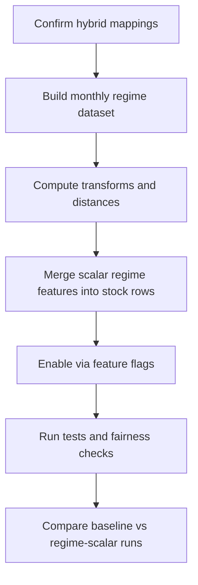

# Phase 1 Plan: Global Scalar Regime Feature (Hybrid FRED + LSEG)

## Scope and Defaults

- Implement the **global scalar regime feature** only (no latent regime memory, no model architecture changes).
- Initial variable subset (confirmed): **market, yield curve, oil, copper, stock-bond correlation**.
- Data source policy: **hybrid sourcing**.
  - Prefer **FRED** for macro/fixed-income series where history and definitions are cleaner.
  - Prefer **LSEG** for market instruments and futures proxies (including copper `.MXCOPPFE`).
  - Keep per-variable source priority explicit and configurable.
- Keep all new behavior behind feature flags so default runs remain unchanged.

## Proposed Data Contract

- Add a new monthly regime dataset keyed by `dt` with columns:
  - `regime_global_score`
  - `regime_similarity_q20_mean`
  - `regime_dissimilarity_q80_mean`
  - `regime_similarity_spread`
  - Optional diagnostics: variable-level transformed z-like series.
- Merge these features into stock rows by date and broadcast to all stocks (same pattern as VIX/credit in [C:/Users/magil/Current_MCI_GRU/MCI-GRU/mci_gru/features/volatility.py](C:/Users/magil/Current_MCI_GRU/MCI-GRU/mci_gru/features/volatility.py) and [C:/Users/magil/Current_MCI_GRU/MCI-GRU/mci_gru/features/credit.py](C:/Users/magil/Current_MCI_GRU/MCI-GRU/mci_gru/features/credit.py)).

## Series Mapping Workflow (Hybrid Confirmation)

- Create a mapping table for each variable with:
  - `logical_name`, `primary_source`, `fallback_source`, `instrument_or_series_id`, `field`, `frequency`, `transform_method`.
- Seed the table with proposed mappings (including copper example `.MXCOPPFE`) and request your approval per row before coding.
- For each series, define a **point-in-time-safe availability lag** and missing-data policy.

### Initial Source Priorities for the 5 selected variables

- `sp500_market`: LSEG primary, FRED fallback if needed.
- `yield_curve (10Y-3M)`: FRED primary (`DGS10`, `TB3MS`), LSEG fallback.
- `oil (WTI)`: FRED primary (`DCOILWTICO`), LSEG fallback.
- `copper`: LSEG primary (e.g. `.MXCOPPFE`), no FRED default equivalent.
- `stock_bond_corr`: computed internally from stock and yield inputs, using same source-priority rules.

## Transformation + Similarity Method (from Man framework)

- For each selected variable:
  - Compute **12-month change**.
  - Compute rolling normalization over **10 years** (120 monthly obs), winsorized/clipped.
- For each month `T`, compute Euclidean distance to all valid historical months `i < T`:
  - aggregate variable-level distances into one **Global Score**.
- Derive scalar features from distance distribution:
  - mean of most similar bucket (q20), most dissimilar bucket (q80), and spread.
- Exclude the most recent trailing window for similarity matching (paper-style anti-momentum safeguard) as configurable parameter.

## Integration Points (No Behavior Breakage)

- Feature constants + add/merge logic:
  - [C:/Users/magil/Current_MCI_GRU/MCI-GRU/mci_gru/features/registry.py](C:/Users/magil/Current_MCI_GRU/MCI-GRU/mci_gru/features/registry.py)
  - New module: `mci_gru/features/regime.py` (scalar computation + merge).
- Data loading hooks for hybrid macro series:
  - [C:/Users/magil/Current_MCI_GRU/MCI-GRU/mci_gru/data/data_manager.py](C:/Users/magil/Current_MCI_GRU/MCI-GRU/mci_gru/data/data_manager.py)
  - [C:/Users/magil/Current_MCI_GRU/MCI-GRU/mci_gru/data/lseg_loader.py](C:/Users/magil/Current_MCI_GRU/MCI-GRU/mci_gru/data/lseg_loader.py)
  - [C:/Users/magil/Current_MCI_GRU/MCI-GRU/mci_gru/data/fred_loader.py](C:/Users/magil/Current_MCI_GRU/MCI-GRU/mci_gru/data/fred_loader.py)
- Config flags and defaults:
  - [C:/Users/magil/Current_MCI_GRU/MCI-GRU/mci_gru/config.py](C:/Users/magil/Current_MCI_GRU/MCI-GRU/mci_gru/config.py)
  - [C:/Users/magil/Current_MCI_GRU/MCI-GRU/configs/config.yaml](C:/Users/magil/Current_MCI_GRU/MCI-GRU/configs/config.yaml)
- Experiment path remains unchanged except passing new optional inputs:
  - [C:/Users/magil/Current_MCI_GRU/MCI-GRU/run_experiment.py](C:/Users/magil/Current_MCI_GRU/MCI-GRU/run_experiment.py)

## Bias and Fairness Safeguards (Mandatory)

- Enforce **no look-ahead**:
  - similarity at month `T` only uses data available at or before `T` with explicit lag rules.
- Avoid survivorship interactions:
  - keep regime series market-level and independent of per-stock complete-history filtering.
- Preserve existing feature behavior:
  - if regime load fails, either soft-fail with zero columns (configurable) or stop run (strict mode).

## Validation and Acceptance Tests

- Unit tests for transform correctness:
  - 12m delta, rolling-window normalization, clipping bounds.
- Unit tests for similarity logic:
  - verify `i < T` constraint and expected bucket statistics.
- Integration test:
  - confirms feature columns present and merged without changing tensor shapes unexpectedly.
- Backtest fairness check:
  - confirm no future-date usage in regime feature generation timestamps.

## Rollout Sequence

## Immediate Next Action

- Draft and share the **hybrid mapping table proposal** for the 5 selected variables (including copper `.MXCOPPFE`) for your row-by-row approval before implementation starts.

