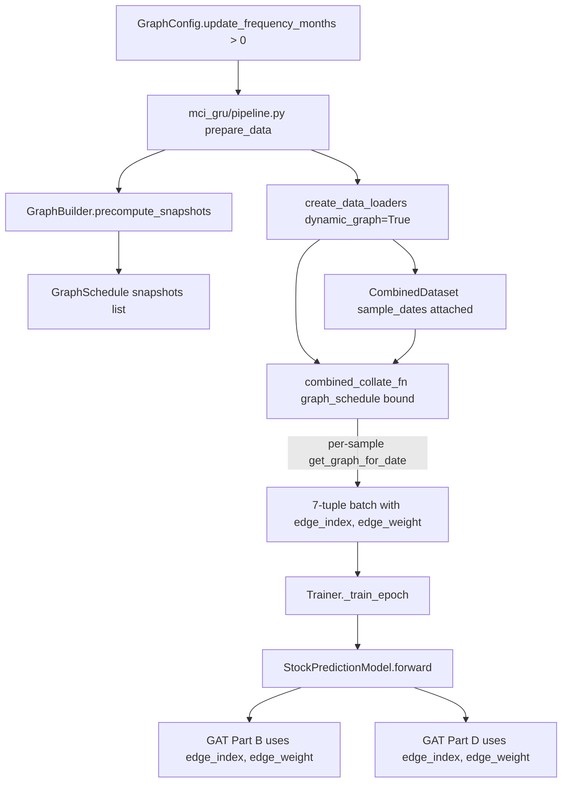

# MCI-GRU Dynamic Graph: Audit Findings and Improvement Roadmap

## 1. Audit summary - the wiring is correct

The dynamic correlation graph is being computed, scheduled, and delivered to the model on every batch. A diagnostic against real SP500 data (`scripts/diagnose_dynamic_graph.py`) over 2019-01 to 2025-12 with the production settings (`judge_value=0.8`, `corr_lookback_days=252`, `update_frequency_months=6`) showed dramatic snapshot-to-snapshot variation, including a 16x edge-count spike around COVID and a Jaccard similarity as low as 0.058 between consecutive snapshots. So "almost no change in results" when toggling dynamic mode is not a wiring bug.

### Verified call chain



Files confirming each step:
- [mci_gru/graph/builder.py](mci_gru/graph/builder.py) - `GraphBuilder.precompute_snapshots`, `GraphSchedule.get_graph_for_date` (bisect lookup, no lookahead)
- [mci_gru/pipeline.py](mci_gru/pipeline.py) lines 247-251 - schedule built when `update_frequency_months > 0`
- [run_experiment.py](run_experiment.py) line 166 - `dynamic_graph = config.graph.update_frequency_months > 0`
- [mci_gru/data/data_manager.py](mci_gru/data/data_manager.py) lines 526-535 - per-sample edge lookup in `combined_collate_fn`
- [mci_gru/training/trainer.py](mci_gru/training/trainer.py) lines 185-203 - 7-tuple unpacked and passed straight to model
- [mci_gru/models/mci_gru.py](mci_gru/models/mci_gru.py) lines 382, 395 - both GAT blocks consume `edge_index`, `edge_weight`

### Why metric movement was small anyway
- `Z = [A1, A2, B1, B2]` in [mci_gru/models/mci_gru.py](mci_gru/models/mci_gru.py) line 385: only `A2` (Part B GAT) and `B2` (cross-attention over `R2` using `A2`) depend on the graph. `A1` and `B1` are graph-independent. Graph influence is capped at ~50% of the final GAT input.
- Edge weights live in (0.80, 0.97]; after `GATConv.lin_edge` projection and per-node softmax those tiny differences get compressed.
- Val/test windows (2024-2025) sit in a low-density correlation regime - val-loss-driven early stopping selects on a near-static graph.
- 10-model averaging in [mci_gru/training/trainer.py](mci_gru/training/trainer.py) `train_multiple_models` damps small graph-induced deltas with init noise.
- Cosmetic note (not a bug): `graph_data.pt` saved by [run_experiment.py](run_experiment.py) lines 156-163 is the first snapshot only. The trainer never reads it.

### Reproducible diagnostic
[scripts/diagnose_dynamic_graph.py](scripts/diagnose_dynamic_graph.py) loads `data/raw/market/sp500_2019_universe_data_through_2026.csv`, builds the schedule, and prints per-snapshot edge counts, consecutive-snapshot Jaccard, mean/max |delta-edge-weight|, and full-matrix mean |delta-corr|. Run on the new machine with:

```powershell
$env:PYTHONIOENCODING="utf-8"; py -3.13 scripts/diagnose_dynamic_graph.py
```

Expect to see edge counts swinging roughly 83 -> 3704 over the 14 snapshots and Jaccard < 0.1 around 2020-07.

## 2. Improvement roadmap - four levers, ranked by impact-per-effort

### Lever 1 - Stop discarding edge information (biggest easy win)
[mci_gru/graph/builder.py](mci_gru/graph/builder.py) `build_edges` filters `corr > 0.8` only and discards sign and magnitude.

- 1a Top-K neighbors per node instead of global threshold. Add `GraphConfig.top_k`. Replace `mask = (corr > self.judge_value)` with per-row argpartition. Guarantees ~K*N edges, preserves ranking.
- 1b Signed two-relation graph. Keep `corr > tau_pos` as `R_pos`, add `corr < tau_neg` (e.g. -0.3) as `R_neg`. Either swap `GATConv` for `RGATConv` in [mci_gru/models/mci_gru.py](mci_gru/models/mci_gru.py) `GATBlock`, or run two parallel `GATBlock`s and concatenate. Recovers 100% of currently-discarded negative correlations.
- 1c Multi-feature edges. Pass per-edge feature `[corr, |corr|, corr^2, rank_pct, snapshot_age_days]` instead of scalar. Set `GATConv(..., edge_dim=5)` in `GATBlock.__init__`. Lets attention discriminate 0.82 vs 0.95 and lets it see snapshot age.

### Lever 2 - Use a more predictive edge definition
Contemporaneous Pearson correlation is a weak signal for next-day returns.

- 2a Lead-lag correlation. For each pair compute `corr(r_i,t, r_j,t+k)` for `k in {1, 2, 3, 5}`. Keep strongest-signed lag, store the lag value as an edge feature. Edit point: `GraphBuilder.compute_correlation_matrix` in [mci_gru/graph/builder.py](mci_gru/graph/builder.py) lines 69-93.
- 2b Residual / partial correlation. Regress each stock on market + size + sector (or your existing regime variables) and correlate residuals. Same API surface, different input series.
- 2c Static sector + dynamic correlation as parallel graphs. Build a static GICS-membership graph; pass both through parallel `GATBlock`s in [mci_gru/models/mci_gru.py](mci_gru/models/mci_gru.py) `StockPredictionModel.__init__` and concatenate before `proj_cross`.

### Lever 3 - Let the graph influence more of the representation
Currently only `A2` and `B2` depend on edges. Push graph dependence into `A1` and `B1`.

- 3a Graph-aware temporal encoder. Inside `ImprovedGRU.forward` and/or `MultiScaleTemporalEncoder.forward` in [mci_gru/models/mci_gru.py](mci_gru/models/mci_gru.py), after each GRU step apply `h_t <- (1 - lambda) * h_t + lambda * GAT(h_t, edge_index, edge_weight)` with a learnable scalar `lambda`. Requires plumbing `edge_index, edge_weight` through `temporal_encoder`. Largest lift, largest expected payoff.
- 3b Graph-conditioned latent states. In `MarketLatentStateLearner.forward`, replace `self.R1` with `self.R1 + GAT(A1.mean_per_stock, edge_index)`. Cheap, makes `B1` graph-aware.
- 3c Learned fusion gate. Replace `Z = torch.cat([A1, A2, B1, B2], dim=-1)` with `Z = g1*A1 + g2*A2 + g3*B1 + g4*B2` where `g*` come from a tiny MLP that sees batch edge density and regime features. Adapts graph weight to regime.

### Lever 4 - Make updates match market dynamics
- 4a Shorter or event-driven cadence. Drop `update_frequency_months` to 1, or trigger snapshot when `||C_now - C_prev||_F` exceeds a threshold. `GraphSchedule` already supports arbitrary update dates - only the policy in `GraphBuilder.get_update_dates` needs to change.
- 4b Shorter correlation window. Drop `corr_lookback_days` from 252 to 63 or 21. Combine with 4a for responsiveness.
- 4c Rate-of-change edge feature. Store `corr - corr_prev_snapshot` per edge as a feature, exposing decoupling/coupling speed to the model.

## 3. Recommended execution sequence on the main PC

1. Bench the audit on the main PC. Run [scripts/diagnose_dynamic_graph.py](scripts/diagnose_dynamic_graph.py) to confirm the same snapshot-variation pattern. If edge counts look flat, suspect an environment / data path mismatch first.
2. Lever 1a + 1c together (1-2 hours). Top-K=20 edges plus 5-dim edge feature. Rerun dynamic vs static. If the gap opens, the architecture was edge-starved.
3. Lever 4b (half-day). Shorten `corr_lookback_days` to 63, `update_frequency_months` to 3. Confirms responsiveness.
4. Lever 2a (day or two). Lead-lag edges. Most directly aligned with prediction target, highest expected IC lift.
5. Lever 3a (multi-day). Graph-aware temporal encoder. Largest architectural change, biggest long-term payoff.

## 4. Suggested per-step verification

For every step, capture before/after on the same seed and same data slice:
- Mean per-batch edge count distribution (instrument [mci_gru/data/data_manager.py](mci_gru/data/data_manager.py) `combined_collate_fn`).
- Best val loss across the 10-model average ([mci_gru/training/trainer.py](mci_gru/training/trainer.py) `train_multiple_models`).
- Test-period IC and rank IC ([mci_gru/training/metrics.py](mci_gru/training/metrics.py)).
- Graph-only ablation: rerun with edges zeroed out at collate time to bound the graph contribution.

## 5. Files most likely to change

- [mci_gru/graph/builder.py](mci_gru/graph/builder.py) - new edge selection (top-K, signed, lead-lag), multi-feature edges
- [mci_gru/config.py](mci_gru/config.py) - `GraphConfig` additions (`top_k`, `tau_neg`, `edge_features`, `lead_lags`, etc.)
- [mci_gru/data/data_manager.py](mci_gru/data/data_manager.py) - collate must concat 2D edge-feature tensors instead of 1D `edge_weight`
- [mci_gru/models/mci_gru.py](mci_gru/models/mci_gru.py) - `GATBlock(edge_dim=...)`, optional `RGATConv`, graph-aware temporal encoder, fusion gate
- [mci_gru/training/trainer.py](mci_gru/training/trainer.py) - 7-tuple may grow to 8 if multi-relation graph is added
- [configs/experiment/correlation_dynamic.yaml](configs/experiment/correlation_dynamic.yaml) - one experiment file per lever for clean A/B
- [tests/test_dynamic_graph_updates.py](tests/test_dynamic_graph_updates.py) - extend to cover top-K, signed graph, multi-feature edges