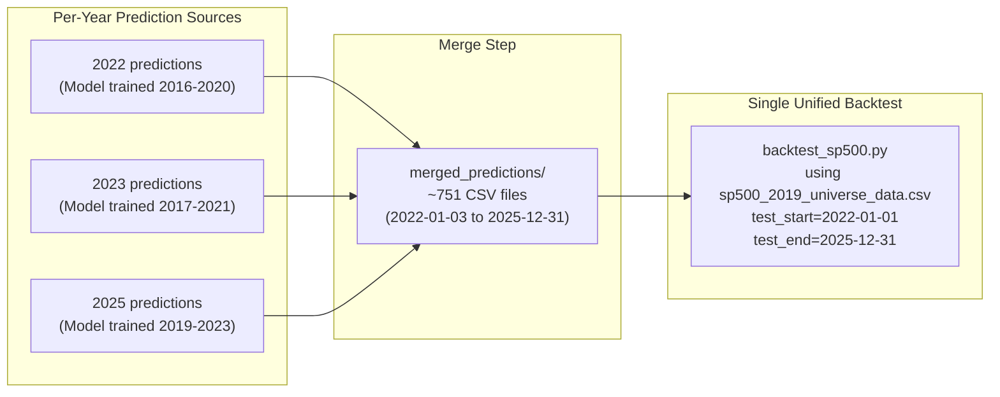

# Multi-Year Walk-Forward Backtest (Option A)

## How It Works

The portfolio is **continuous** -- no liquidation between years. When the underlying model changes (e.g., Jan 2 2023), it's just another rebalance day. The rank-drop gate smooths the transition naturally.

## Prediction Sources

- **2022**: `seed_results/2022/seed7/averaged_predictions/` (251 files)
- **2023**: `seed_results/2023/2023_averaged_predictions/` (250 files)
- **2025**: user-specified seed folder, e.g. `seed_results/2025/seed7/averaged_predictions/` (250 files)
- **2024**: skipped for now (gap in equity curve is acceptable; can be added later)

Since dates don't overlap, merging is just copying/symlinking all CSVs into one flat folder.

## Universe File

Use `data/raw/market/sp500_2019_universe_data.csv` for the entire backtest. This is the superset -- it contains all stocks from earlier universes plus additions through 2019. Stocks that aren't scored by a given year's model simply won't appear in that year's prediction CSVs, so the backtest engine naturally restricts the tradeable set per year with no extra logic.

## What to Build

A single Python script (`multiyear_backtest.py`) at the repo root that:

1. **Accepts CLI arguments** for:
  - A list of `--prediction_dirs` (one per year, in chronological order)
  - `--data_file` (universe CSV, default: 2019 superset)
  - `--test_start` / `--test_end` (full date range)
  - All existing backtest flags (`--top_k`, `--enable_rank_drop_gate`, `--min_rank_drop`, `--transaction_costs`, `--spread`, `--auto_save`, `--plot`)
2. **Merges predictions** by creating a temporary folder and symlinking (or copying) all date CSVs from each source folder into it. Validates no date collisions.
3. **Calls the existing backtest** by importing `load_stock_data`, `calculate_forward_returns`, `load_predictions`, `simulate_trading_strategy` from `tests/backtest_sp500.py` -- no engine duplication.
4. **Handles the 2024 gap** gracefully: the backtest will simply have no predictions for 2024 dates, so no trades happen and the portfolio sits in cash (or we can log a warning and skip those dates). A cleaner option: detect the gap and annotate it on the equity curve plot.
5. **Outputs** the same artifacts as the regular backtest (equity curve, daily returns CSV, summary metrics) but across the full multi-year window, plus a per-year breakdown table showing ARR/ASR/MDD for each segment.

## Key Design Decisions

- **No code changes to `backtest_sp500.py`** -- we only import from it
- The merge folder is created under the output directory (or a temp dir), not polluting the source prediction folders
- The script validates that prediction date ranges don't overlap before merging
- Per-year metrics are computed by slicing the unified daily returns by calendar year

