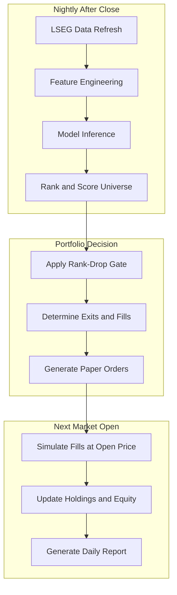

# MCI-GRU Paper Trading System

## Architecture Overview




---

## Phase 1: Model Training (One-Time Setup) -- COMPLETE

Trained on Colab with seed 73. All artifacts placed in `paper_trade/Model/Seed73_trained_to_2062026/`:


| Artifact            | Path                                                                                             |
| ------------------- | ------------------------------------------------------------------------------------------------ |
| Config              | `paper_trade/Model/Seed73_trained_to_2062026/config.yaml`                                        |
| Normalization stats | `paper_trade/Model/Seed73_trained_to_2062026/run_metadata.json`                                  |
| Graph structure     | `paper_trade/Model/Seed73_trained_to_2062026/graph_data.pt`                                      |
| Checkpoints (x10)   | `paper_trade/Model/Seed73_trained_to_2062026/checkpoints/model_0_best.pth` .. `model_9_best.pth` |


Training window: train `2020-01-01` to `2025-06-30`, val `2025-07-01` to `2026-02-05`.
Config: `his_t=60`, `label_t=21`, `loss_type=mse`, `label_type=rank`, `num_models=10`, `seed=73`.
Universe: 481 stocks (2019-era S&P 500 constituents, LSEG RICs).
Features: 14 columns (6 OHLCV + turnover + 7 momentum + 1 cycle).

---

## Phase 2: LSEG Data Refresh

### How to Use the Existing LSEG Loader

The [LSEGLoader](mci_gru/data/lseg_loader.py) class already supports everything needed. The nightly refresh script should:

**Step 1 -- Incremental OHLCV update:**

Use `LSEGLoader.get_historical_prices()` to fetch only recent data, then append to the master CSV. The loader already handles batching (50 RICs), rate limiting, MultiIndex reshaping, and RIC-to-ticker mapping.

```python
from mci_gru.data.lseg_loader import LSEGLoader

loader = LSEGLoader()
loader.connect()

rics = load_rics("data/raw/constituents/sp500_constituents_2019.csv")
latest_date_in_csv = get_last_date("data/raw/market/sp500_2019_universe_data_through_2026.csv")
today = datetime.now().strftime("%Y-%m-%d")

new_data = loader.get_historical_prices(
    rics=rics,
    start=latest_date_in_csv,
    end=today,
    batch_size=50,
)
# Append new_data to master CSV, dedup on (kdcode, dt)
```

**Step 2 -- Regime data update (if using regime features):**

Use `LSEGLoader.get_series()` for copper (`.MXCOPPFE`), market (`.SPX`), oil (`CLc1`). This is the same method [export_lseg_regime.py](scripts/export_lseg_regime.py) already uses.

**Step 3 -- Validation checks:**

- Confirm today's date is present in the refreshed data
- Confirm expected stock count (should be ~500, warn if <400)
- Confirm no critical null columns in OHLCV

---

## Phase 3: Standalone Inference Script

Create `scripts/paper_trade/infer.py`. This is the core new code.

### Inputs

- Refreshed master CSV (from Phase 2)
- Frozen model checkpoints
- `run_metadata.json` (means, stds, feature_cols, kdcode_list)
- Config YAML

### Processing Steps

1. Load CSV, apply `FeatureEngineer.transform()`
2. Fill NaN per day (mean imputation) -- same as [run_experiment.py](run_experiment.py) lines 316-328
3. Normalize using saved `means`/`stds` with 3-sigma clipping -- same as lines 344-355
4. Filter to `kdcode_list` from training
5. Build sliding windows via `generate_time_series_features()` for the most recent `his_t=60` days
6. Build graph features via `generate_graph_features()` for the latest date
7. Build `edge_index`/`edge_weight` via `GraphBuilder`
8. For each of the 10 checkpoints:
  - Create model with `create_model(num_features, config)`
  - Load state dict with `torch.load(path, weights_only=True)`
  - Run `model.eval()` + forward pass
9. Average predictions across 10 models
10. Output: `scores_YYYY-MM-DD.csv` with columns `kdcode, dt, score`

### Output Format

Same schema as existing `averaged_predictions/` CSVs:

- `kdcode` -- stock identifier
- `dt` -- prediction date
- `score` -- model output (higher = better predicted return)

---

## Phase 4: Portfolio Decision Engine

Create `scripts/paper_trade/portfolio.py`. Replicates the rank-drop gate logic from [backtest_sp500.py](tests/backtest_sp500.py) lines 1052-1091.

### Core Logic (pseudocode)

```
load today's scores -> sort descending -> assign rank (1 = best)
load yesterday's holdings + yesterday's ranks

for each held stock:
    rank_drop = today_rank - yesterday_rank
    if rank_drop >= 30:
        mark for EXIT
    else:
        mark as SURVIVOR

slots_needed = 20 - len(survivors)
fill from top-ranked non-survivors

output: target_holdings (list of 20 tickers, equal weight 5% each)
output: orders (BUY new names, SELL exited names)
```

### Tie-Breaking

If scores are identical, break ties by ticker name ascending (alphabetical) for determinism.

### State Files

Under `paper_trading/state/`:

- `current_holdings.json` -- current portfolio (tickers, entry dates, reference ranks)
- `prev_ranks.json` -- yesterday's full rank table

---

## Phase 5: Execution Simulation and Return Tracking

Create `scripts/paper_trade/track.py`.

### Fill Simulation

After market open, fetch today's open prices from LSEG:

```python
open_prices = loader.get_historical_prices(
    rics=held_rics,
    start=today,
    end=today,
)
```

Use the `open` column as the fill price.

### Return Calculation

Follow the backtest convention from [backtest_sp500.py](tests/backtest_sp500.py) lines 727-731:

- `open_to_open_return = open_tomorrow / open_today - 1`
- Portfolio return = equal-weighted mean across holdings
- Benchmark = same open-to-open return for the full universe (or SPY)

### Persisted Files (per day, under `paper_trading/YYYY-MM-DD/`)

- `scores.csv` -- full universe scores and ranks
- `target_portfolio.csv` -- 20 names with weight, rank, score
- `orders.csv` -- ticker, side, reason (gate exit / new entry)
- `fills.csv` -- ticker, open_price, weight
- `holdings.csv` -- post-fill holdings snapshot
- `daily_return.csv` -- portfolio, benchmark, excess, turnover, cost

### Cumulative Files (under `paper_trading/`)

- `performance.csv` -- appended daily: date, daily_ret, cum_ret, benchmark_ret, excess_ret, drawdown, turnover
- `equity_curve.png` -- regenerated nightly
- `trade_log.csv` -- all trades with timestamps

---

## Phase 6: Daily Report

Create `scripts/paper_trade/report.py`.

### Report Contents

- **Header:** date, run ID, data freshness check
- **Performance:** daily return, cumulative return, excess, drawdown
- **Portfolio snapshot:** 20 holdings with rank, score, weight, daily stock return, contribution
- **Changes:** names added, names dropped (with rank-drop that triggered exit)
- **Trading stats:** turnover, number of trades, estimated cost drag
- **Rolling stats:** 20-day vol, annualized Sharpe proxy, max drawdown to date
- **Equity curve chart** (updated)

### Format

- `daily_report_YYYY-MM-DD.md` (human-readable)
- `daily_report_YYYY-MM-DD.json` (machine-readable)

---

## Phase 7: Orchestration

Create `scripts/paper_trade/run_nightly.py` as the single entry point.

### Sequence

1. Validate Refinitiv Workspace is running
2. Refresh LSEG data (append to master CSV)
3. Run inference (load checkpoints, score universe)
4. Run portfolio decision (rank-drop gate)
5. Output paper orders for next open
6. (Next day) Fetch open prices, simulate fills, compute returns
7. Generate daily report and update equity curve

### Scheduling

- Windows Task Scheduler: trigger at 4:30 PM ET on weekdays
- Or: manual run from PowerShell with `lseg_env` activated

---

## File Layout

```
paper_trade/
    Model/
        Seed73_trained_to_2062026/     -- frozen model artifacts (Phase 1, COMPLETE)
            config.yaml
            run_metadata.json
            graph_data.pt
            checkpoints/model_0..9_best.pth
    scripts/
        run_nightly.py                 -- orchestrator (Phase 7)
        refresh_data.py                -- LSEG data refresh (Phase 2)
        infer.py                       -- standalone inference (Phase 3)
        portfolio.py                   -- rank-drop gate + portfolio (Phase 4)
        track.py                       -- fill simulation + returns (Phase 5)
        report.py                      -- daily report generation (Phase 6)
    state/
        current_holdings.json
        prev_ranks.json
        run_manifest.json
    results/
        YYYY-MM-DD/
            scores.csv
            target_portfolio.csv
            orders.csv
            fills.csv
            holdings.csv
        performance.csv
        trade_log.csv
        equity_curve.png
```

