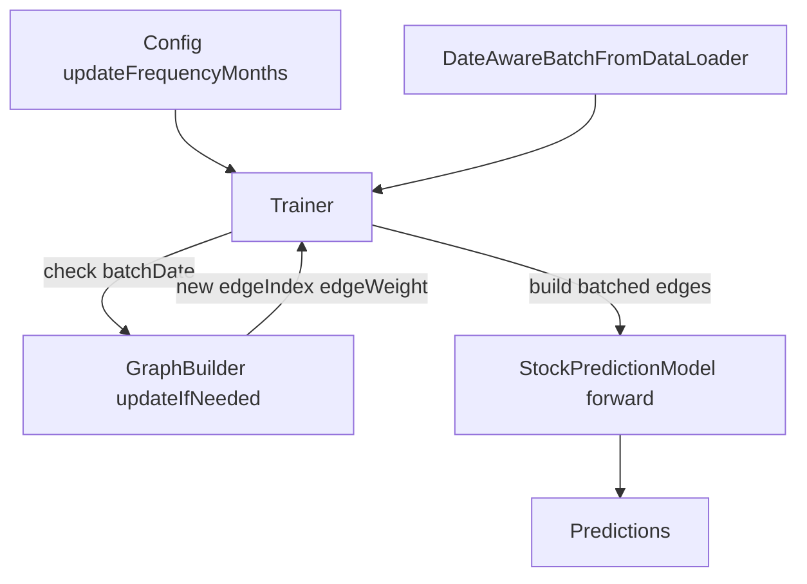

# Patch Dynamic Graph Updates To Be Active And Leakage-Safe

## Goal

Make `graph.update_frequency_months` (e.g., 6) truly functional by ensuring updated edges are consumed by the model during training, and updates are triggered on chronology-safe dates.

## Implementation Scope

- [mci_gru/training/trainer.py](mci_gru/training/trainer.py)
- [mci_gru/data/data_manager.py](mci_gru/data/data_manager.py)
- [run_experiment.py](run_experiment.py)
- (new) [tests/test_dynamic_graph_updates.py](tests/test_dynamic_graph_updates.py)

## Planned Changes

- Add date-aware batch metadata to the training pipeline:
  - Extend dataset/collate output to include sample `dt` (or date index) for each batch item.
  - Keep existing behavior unchanged when dynamic updates are disabled.
- Make dynamic updates chronology-safe and deterministic:
  - In `Trainer`, trigger graph updates from batch dates (not `epoch % len(train_dates)`), so update checks use actual training timeline.
  - Enforce monotonic batch-date progression when dynamic updates are enabled (disable shuffle in that mode) to prevent future-date graph usage on earlier samples.
- Wire updated graph into model calls:
  - Introduce a single helper in `Trainer` to build batched `edge_index/edge_weight` from the current graph state.
  - Use current graph tensors for train/val/test forward passes after each update (instead of static collate-captured edges).
- Improve observability:
  - Log initial graph date/edge count and each dynamic update event (`from_date -> to_date`, edge count delta).
  - Add a final summary confirming how many updates occurred.

## Leakage/Bias Safeguards

- Preserve causal graph construction (`df['dt'] < end_date`) from [mci_gru/graph/builder.py](mci_gru/graph/builder.py).
- Ensure updated graphs are only applied to samples at/after the update date.
- No survivorship-bias expansion in this patch; stock universe handling remains unchanged (called out explicitly in notes).

## Validation Plan

- Unit/integration tests:
  - Verify at least one update fires for a synthetic date range with `update_frequency_months=6`.
  - Verify model forward uses post-update edges (edge tensor identity/shape/value assertions before vs after update).
  - Verify no update when `update_frequency_months=0` (backward compatibility).
- Smoke run:
  - Run one small training job with `+experiment=correlation_dynamic` and confirm update logs appear.
  - Compare with static run to confirm update count differs and graph stats change over time.

## Dataflow (post-patch)

