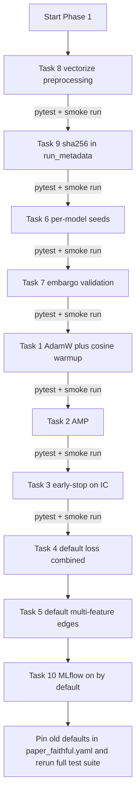

# Phase 1 – Free-Lunch Upgrades (no model surgery)

Target: [docs/ARCHITECTURE_REVIEW.md](docs/ARCHITECTURE_REVIEW.md) Section 9, Phase 1 checklist. Every change below is intended to be a strict Pareto improvement: same code paths, better defaults, no new architecture.

## Invariants preserved

- 7-tuple collate contract from `AGENTS.md` (edge_weight may be `(E,)` or `(E,4)`).
- No lookahead (normalization, graph, labels still use train-period cutoffs).
- Paper-trade isolation (`paper_trade/` does not import `GraphBuilder`; only loads `graph_data.pt`).
- Ensemble averaging semantics (still `train_multiple_models`, still mean of predictions).

## Success criteria (run after each task)

- `python -m pytest tests/ -v` stays green.
- `python run_experiment.py training.num_epochs=2 training.num_models=1` smoke-runs to completion with no new warnings.
- Existing `configs/experiment/paper_faithful.yaml` reproduces the prior behaviour by pinning the old defaults explicitly (so historical baselines are still reproducible).

## Task-by-task changes

### 1. AdamW + CosineAnnealingLR + linear warmup
Files: [mci_gru/training/trainer.py](mci_gru/training/trainer.py), [mci_gru/config.py](mci_gru/config.py), [configs/config.yaml](configs/config.yaml).

- In `Trainer.train`, replace `optim.Adam(...)` with `optim.AdamW(...)`. Build a `torch.optim.lr_scheduler.LambdaLR` warmup (linear 0 → 1 over `warmup_steps`) chained via `SequentialLR` with `CosineAnnealingLR(T_max=num_epochs * steps_per_epoch - warmup_steps, eta_min=lr*0.01)`. Step the scheduler **per optimizer step**, not per epoch, so warmup is expressed in steps.
- Add `warmup_steps: int = 1000` and `lr_scheduler: str = "cosine"` (values `"none"|"cosine"`) to `TrainingConfig` with validation; default `"cosine"`. Keep `lr_scheduler: none` as a valid escape hatch so `paper_faithful.yaml` can pin it.
- `configs/config.yaml`: surface `warmup_steps` and `lr_scheduler` under `training:`.

Reason: AdamW decouples weight decay (correct for attention models); cosine + warmup is standard for transformer/attention stacks. Escape hatch preserves ability to reproduce the old constant-LR Adam baseline.

### 2. Mixed precision on CUDA
File: [mci_gru/training/trainer.py](mci_gru/training/trainer.py).

- Build `scaler = torch.amp.GradScaler("cuda", enabled=self.device.type == "cuda")` alongside the optimizer.
- Wrap the forward in `with torch.amp.autocast("cuda", enabled=self.device.type == "cuda"):`, use `scaler.scale(loss).backward()`, unscale before `clip_grad_norm_` (`scaler.unscale_(optimizer)` then clip), then `scaler.step(optimizer)` / `scaler.update()`.
- Do the same guard in `_validate` (autocast only; no scaler).
- Add `use_amp: bool = True` to `TrainingConfig` so CPU-only users or exact-repro runs can disable.

Reason: free ~2× throughput on CUDA, no math changes on CPU fallback.

### 3. Early-stop on validation IC (not MSE)
Files: [mci_gru/training/trainer.py](mci_gru/training/trainer.py), [mci_gru/config.py](mci_gru/config.py), [configs/config.yaml](configs/config.yaml).

- Extend `_validate` to return a small dataclass (or tuple) with `loss` **and** `ic` (cross-sectional Pearson between `outputs` and `labels`, computed with the same logic as `ICLoss` but returning positive IC, averaged over batch elements).
- Add `selection_metric: str = "val_ic"` to `TrainingConfig` (`"val_loss"|"val_ic"`). In `Trainer.train`, maintain `best_score` where better = lower for `val_loss` and higher for `val_ic`, and set the patience/checkpoint trigger accordingly.
- `TrainingResult` gains `best_val_ic: float` alongside `best_val_loss`.
- Update `epoch_callback` signature to `(epoch, train_loss, val_loss, val_ic, best_score)` (or pass a dict). Update `MLflowTrackingManager.log_epoch_metrics` call sites accordingly (check [mci_gru/tracking/mlflow_manager.py](mci_gru/tracking/mlflow_manager.py) for the current signature; adjust minimally).

Reason: the deployment objective is a cross-sectional ranker. Selecting checkpoints by MSE optimises the wrong thing when `loss_type` is `mse` or `combined`.

### 4. Default loss = combined (alpha=0.5)
File: [configs/config.yaml](configs/config.yaml).

- Change `training.loss_type: mse` → `training.loss_type: combined` (keep `ic_loss_alpha: 0.5`).
- Pin `loss_type: mse` in [configs/experiment/paper_faithful.yaml](configs/experiment/paper_faithful.yaml) to preserve the paper baseline.

Reason: anchors scale via MSE while directly optimising rank correlation, matching the evaluation metric.

### 5. Default `use_multi_feature_edges = true`
Files: [configs/config.yaml](configs/config.yaml), [mci_gru/config.py](mci_gru/config.py).

- Flip default to `true` in both the YAML and `GraphConfig`.
- Pin `graph.use_multi_feature_edges: false` in `paper_faithful.yaml` (and any experiment YAML that currently omits it and depends on the old default) so legacy scalar-edge runs still reproduce. Check each file in `configs/experiment/*.yaml` for assumptions.
- `run_experiment.py` already derives `edge_feature_dim = 4 if use_multi_feature_edges else 1` (line ~191); no code change needed there.

Reason: the (E,4) path is strictly more informative, already fully plumbed.

### 6. Per-model ensemble seeds
File: [mci_gru/training/trainer.py](mci_gru/training/trainer.py).

- Inside `train_multiple_models`, before `model = model_factory()`, call a helper that sets `random.seed`, `numpy.random.seed`, `torch.manual_seed`, and `torch.cuda.manual_seed_all` to `config.seed + model_id`. Reuse `set_seed` from `run_experiment.py` by extracting it to `mci_gru/utils/seeding.py` (new tiny module) and importing from there in both `run_experiment.py` and `trainer.py`. This avoids a circular import.

Reason: currently all N ensemble members start from the identical RNG state, so ensemble diversity is only kernel nondeterminism. Per-model seeds make this a real deep ensemble.

### 7. Embargo between splits
File: [mci_gru/config.py](mci_gru/config.py), `DataConfig.__post_init__`.

- After the chronological order check, add: parse each date with `datetime.strptime(..., "%Y-%m-%d")`, require `(val_start - train_end).days > label_t_default_or_configured` and `(test_start - val_end).days > label_t_default_or_configured`.
- Problem: `DataConfig` doesn't know `label_t`. Resolution: add the check in `ExperimentConfig.__post_init__` instead (dataclass `__post_init__` runs after nested fields are built — verify current behaviour and add if absent). Use `self.model.label_t`.
- Make the check raise `ValueError` with a clear message suggesting shifting `val_start` / `test_start` by `label_t` business days. Add a one-liner opt-out `data.skip_embargo_check: bool = False` so historical configs that intentionally have `train_end=2023-12-31 / val_start=2024-01-01` can be run with a warning (and so existing tests don't have to be rewritten in one go).

Reason: with `label_t=5`, the last 5 training labels reference prices inside the validation window; this is small but real leakage.

### 8. Vectorise `generate_time_series_features`
File: [mci_gru/data/preprocessing.py](mci_gru/data/preprocessing.py).

- Replace the `df.iterrows()` loop (lines 41–47) with `df.pivot_table(index="dt", columns="kdcode", values=feature_cols)` or a `set_index(["dt","kdcode"]).unstack("kdcode")[feature_cols]` reshape. Reindex on `all_dates × kdcode_list` to preserve ordering. Convert to a `(num_dates, num_stocks, num_features)` float32 array in one `.values.reshape(...)` call.
- The inner day-offset sliding-window loop is already O(num_dates) and cheap — leave it, or replace with a single `np.lib.stride_tricks.sliding_window_view` call for extra speedup.
- Add a dedicated test in [tests/](tests/) (e.g. `tests/test_preprocessing_vectorised.py`) that runs the new path and the old path on a tiny synthetic DataFrame and asserts element-wise equality. Delete or skip the old path once the test passes.

Reason: currently millions of Python-level attribute lookups on large universes; vectorization is a 50–200× speedup with identical semantics.

### 9. Record `sha256(data_file)` in run metadata
File: [run_experiment.py](run_experiment.py).

- Before writing `run_metadata.json` (line 150), compute a sha256 of `config.data.filename` (stream in 1 MB chunks using `hashlib.sha256`). Add key `"data_file_sha256"` to the `metadata` dict.
- Skip gracefully (log a warning, emit `"data_file_sha256": null`) if the file doesn't exist (e.g. `source=lseg`).
- Also emit `data_file_size_bytes` and `data_file_mtime_iso` so swaps on identical content hashes are visible.

Reason: if `sp500_data.csv` is updated silently (different vendor cut, different universe), old checkpoints will train on different inputs without any diff. Hash pins the input.

### 10. MLflow enabled by default
File: [configs/config.yaml](configs/config.yaml).

- Change `tracking.enabled: false` → `tracking.enabled: true`, leaving `tracking_uri: mlruns` (local file store, no external dependency).
- Verify [tests/test_mlflow_tracking.py](tests/test_mlflow_tracking.py) still passes — it may assume the opt-out default; if so, have the test explicitly override both enabled states.

Reason: for a 10-model ensemble research codebase, local MLflow is near-free and already integrated; opt-out is the right default.

## Execution order (with verify gates)

Rationale for ordering: pure refactors first (8, 9, 6), then config-shaped logic (7), then training-loop surgery (1, 2, 3), then default flips (4, 5, 10). Default flips go last because they may shift numerical outputs and we want the training-loop work already validated before users observe diff.

## Out of scope (explicitly deferred to Phase 2+)

- LayerNorm / Dropout / residuals in the trunk.
- Vectorising `AttentionResetGRUCell` or swapping for `nn.GRU` / Transformer.
- Cross-attention A1↔A2, group-type embedding, FiLM conditioning.
- Walk-forward retraining loop.
- Rank-gauss normalization, survivorship fixes, polars migration.
- Multi-relation / lead-lag graph edges, DropEdge.
- Block-bootstrap CIs, Optuna sweep, CI smoke job.
