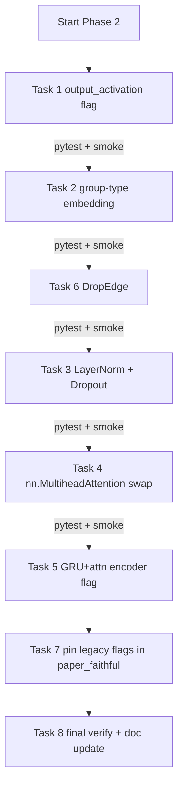

# Phase 2 – Trunk Regularisation & Module Swap

Target: [docs/ARCHITECTURE_REVIEW.md](docs/ARCHITECTURE_REVIEW.md) §9 Phase 2, minus walk-forward and A1↔A2 cross-attention (deferred to Phase 3).

## Invariants preserved

- 7-tuple collate contract (`edge_weight` may be `(E,)` or `(E,4)`).
- No lookahead (graph, norm stats, labels unchanged).
- Paper-trade isolation (`paper_trade/` still reads only `graph_data.pt`).
- Ensemble averaging semantics (`train_multiple_models` + mean of predictions).
- Existing `paper_faithful.yaml` reproduces the pre-Phase-2 numerics **bit-for-bit** via explicit legacy pins on every new flag introduced below.

## Success criteria (run after each task)

- `python -m pytest tests/ -v` stays green.
- `python run_experiment.py +experiment=paper_faithful training.num_epochs=2 training.num_models=1` produces the **same** validation loss as before Phase 2 (±1e-6) — confirms legacy paths untouched.
- `python run_experiment.py training.num_epochs=2 training.num_models=1` smoke-runs on the new defaults.
- `scripts/backtest_sp500_daily.py` (or `tests/backtest_sp500_daily.py` when used as a script) still loads any `best_model.pth` produced with `paper_faithful`.

## Flag strategy

Every Phase-2 change adds a `ModelConfig` (or `GraphConfig`) boolean with a new default that activates the improvement, **plus** an explicit pin in [configs/experiment/paper_faithful.yaml](configs/experiment/paper_faithful.yaml) that turns it off. Rationale: checkpoint compatibility (new `nn.LayerNorm` / `nn.MultiheadAttention` / `nn.GRU` modules add state-dict keys that existing `best_model.pth` files do not contain). All existing `configs/experiment/*.yaml` will be audited and those that currently rely on the paper baseline will get the same pins.

## Task-by-task changes

### 1. Drop asymmetric final activation on regression labels
Files: [mci_gru/models/mci_gru.py](mci_gru/models/mci_gru.py), [mci_gru/config.py](mci_gru/config.py), [configs/experiment/paper_faithful.yaml](configs/experiment/paper_faithful.yaml).

- Add `ModelConfig.output_activation: str = "none"` with valid `{"none", "elu", "relu", "sigmoid"}`; validate in `__post_init__`.
- In `StockPredictionModel.__init__`, map `"none"` → `nn.Identity()`; retain `_make_activation` for the others.
- Keep the `"elu"` legacy path; pin `model.output_activation: elu` in `paper_faithful.yaml`.

Reason: §2.6. ELU clamps predictions at `-1`, biasing the negative tail when `label_type="returns"`. For rank-labels, `sigmoid` is the semantically correct alternative (cross-sectional rank percentile in `[0, 1]`), so expose it explicitly.

### 2. Group-type embedding in `SelfAttention`
Files: [mci_gru/models/mci_gru.py](mci_gru/models/mci_gru.py), [mci_gru/config.py](mci_gru/config.py), [configs/experiment/paper_faithful.yaml](configs/experiment/paper_faithful.yaml).

- Current `SelfAttention` receives a 4×`concat_size` tensor but does not know *which* of A1/A2/B1/B2 each row is. Add `nn.Embedding(4, concat_size)` initialised to small-σ normal; in `forward`, reshape `Z` to `(B, N, 4, align_dim)`, add the type-embed, collapse back to `(B, N, concat_size)`, pass through existing Q/K/V. The reshape is only valid because `Z` is constructed by `torch.cat([A1, A2, B1, B2], dim=-1)` — preserve that order as a contract (add a comment + a 3-line unit test).
- Add `ModelConfig.use_group_type_embed: bool = True`; pin `false` in `paper_faithful.yaml`.

Reason: §2.3, table row 3. Trivial cost, lets the self-attention distinguish streams.

### 3. LayerNorm + Dropout in the trunk
Files: [mci_gru/models/mci_gru.py](mci_gru/models/mci_gru.py), [mci_gru/config.py](mci_gru/config.py), [configs/experiment/paper_faithful.yaml](configs/experiment/paper_faithful.yaml).

- Add `ModelConfig.use_trunk_regularisation: bool = True` and `ModelConfig.trunk_dropout: float = 0.1`.
- In `StockPredictionModel.__init__`, conditionally build:
  - `self.ln_a1 = nn.LayerNorm(align_dim)` applied to `proj_temporal(A1_raw)`.
  - `self.ln_a2 = nn.LayerNorm(align_dim)` applied to `proj_cross(A2_raw)`.
  - `self.ln_z = nn.LayerNorm(concat_size)` applied to `Z` before self-attention / final GAT.
  - `self.drop_z = nn.Dropout(p=trunk_dropout)` after the LN on `Z`.
  - Optional `self.drop_gat = nn.Dropout(p=trunk_dropout)` inside `GATBlock` between layers (gated by the same flag).
- When `use_trunk_regularisation=False`, all of the above resolve to `nn.Identity` so the forward graph is exactly the pre-Phase-2 graph and state-dicts load.
- Pin `use_trunk_regularisation: false` and `trunk_dropout: 0.0` in `paper_faithful.yaml`.

Reason: §2.1. Four-stream trunk has zero regularisation today; LN + dropout are expected to shrink the generalisation gap and reduce seed-to-seed variance.

### 4. `MarketLatentStateLearner` → `nn.MultiheadAttention`
Files: [mci_gru/models/mci_gru.py](mci_gru/models/mci_gru.py), [mci_gru/config.py](mci_gru/config.py), [configs/experiment/paper_faithful.yaml](configs/experiment/paper_faithful.yaml), [tests/test_mci_gru_model.py](tests/test_mci_gru_model.py) (or nearest model smoke test).

- Add `ModelConfig.use_nn_multihead_attention: bool = True` (default new path).
- New implementation path: replace the eight custom `nn.Linear` projections with two `nn.MultiheadAttention(embed_dim=align_dim, num_heads=cross_attn_heads, batch_first=True, dropout=trunk_dropout)` modules and keep `self.R1`, `self.R2` as `nn.Parameter`. Forward becomes:
  ```python
  R1 = self.R1.unsqueeze(0).expand(B*N, -1, -1)   # (B*N, num_latent_states, align_dim)
  A1_q = A1.unsqueeze(1)                          # (B*N, 1, align_dim)
  B1, _ = self.mha1(A1_q, R1, R1, need_weights=False)
  B1 = B1.squeeze(1)
  # analogous for A2, R2
  ```
- Keep the legacy `multi_head_cross_attention` path behind `else:` so paper-faithful state-dicts still load. Pin `use_nn_multihead_attention: false` in `paper_faithful.yaml`.
- Add a shape-equality test: both paths produce `(B*N, align_dim)` outputs for representative inputs.

Reason: §2.4. Uses fused kernels, gets flash-attention when available, removes bespoke weight-init reliance on default `nn.Linear` init, and adds a principled dropout knob via `nn.MultiheadAttention(dropout=...)`.

### 5. Temporal encoder: add CuDNN-fused `nn.GRU` + post-hoc attention path (option d)
Files: [mci_gru/models/mci_gru.py](mci_gru/models/mci_gru.py), [mci_gru/config.py](mci_gru/config.py), [configs/experiment/paper_faithful.yaml](configs/experiment/paper_faithful.yaml), new [tests/test_temporal_encoder.py](tests/test_temporal_encoder.py).

- Add `ModelConfig.temporal_encoder: str = "gru_attn"` with valid `{"legacy", "gru_attn"}` (extensible to `"transformer"` in Phase 3).
- New class `GRUWithAttention(nn.Module)`:
  - `nn.GRU(input_size=input_size, hidden_size=hidden_sizes[-1], num_layers=len(hidden_sizes), batch_first=True)` applied to `(B*N, T, input)`.
  - Single scaled-dot-product attention head `q = h_T`, `K=V=H_all` → attended context; `output = LayerNorm(h_T + context)` to match `output_size = hidden_sizes[-1]`.
  - Expose `.output_size` for downstream alignment with `proj_temporal`.
- `MultiScaleTemporalEncoder` grows a `temporal_encoder` switch too: both fast + slow sub-encoders honour the same flag.
- Route via `create_model`: if `temporal_encoder == "legacy"` build the current `ImprovedGRU`; else build `GRUWithAttention`.
- Pin `model.temporal_encoder: legacy` in `paper_faithful.yaml`.
- Add a test that instantiates both paths on a tiny synthetic `(B, N, T, F)` tensor and asserts shape + finite output + gradient flow; do **not** assert numerical equivalence (different math by design).

Reason: §2.2. At `his_t ≥ 20` the Python recurrent loop dominates epoch time; CuDNN-fused GRU gives 3-8× speedup and AMP compounds it on tensor cores. Legacy path stays for strict paper reproduction.

### 6. DropEdge regularisation at train time
Files: [mci_gru/models/mci_gru.py](mci_gru/models/mci_gru.py), [mci_gru/config.py](mci_gru/config.py), [configs/config.yaml](configs/config.yaml), [configs/experiment/paper_faithful.yaml](configs/experiment/paper_faithful.yaml).

- Add `GraphConfig.drop_edge_p: float = 0.1` (0.0 disables). Validate `0 <= p < 1`.
- In `StockPredictionModel.forward`, when `self.training and self.drop_edge_p > 0`, apply `torch_geometric.utils.dropout_edge(edge_index, edge_attr=edge_weight, p=self.drop_edge_p, force_undirected=False)` once per forward and reuse the thinned `(edge_index, edge_weight)` for both `self.gat_layer` and `self.final_gat` (consistency across the two GAT blocks inside the same forward matters).
- Pin `graph.drop_edge_p: 0.0` in `paper_faithful.yaml`.
- Eval / inference: automatic — `self.training` is False, no-op.

Reason: §5.1 bullet 4, §2.1. Cheap regulariser. Also reduces over-reliance on any single edge — useful because the correlation graph is noisy at short lookbacks.

### 7. Pin legacy defaults on every new flag in `paper_faithful.yaml` + audit `configs/experiment/*.yaml`
Files: [configs/experiment/paper_faithful.yaml](configs/experiment/paper_faithful.yaml), all other `configs/experiment/*.yaml`.

- Final `paper_faithful.yaml` block additions:
  ```yaml
  model:
    output_activation: elu
    use_group_type_embed: false
    use_trunk_regularisation: false
    trunk_dropout: 0.0
    use_nn_multihead_attention: false
    temporal_encoder: legacy
  graph:
    drop_edge_p: 0.0
  ```
- `rg -l '^model:' configs/experiment/` for every file; any config that previously reproduced the paper implicitly (e.g. `lookback_sweep.yaml`) must either inherit `paper_faithful` via Hydra defaults or explicitly pin the same legacy flags.

Reason: a silent baseline shift would make the Phase-2 A/B comparison impossible.

### 8. Final verification + backtest-compat smoke
Files: none (test-run + doc update).

- Run `python -m pytest tests/ -v`.
- Run a 2-epoch, 1-model smoke on **new defaults**, on `paper_faithful`, and on `paper_faithful` with `model.temporal_encoder=legacy use_nn_multihead_attention=false use_trunk_regularisation=false` confirmed loading a pre-Phase-2 `best_model.pth` from a prior seed dir in `seed_results/`.
- Update [docs/ARCHITECTURE_REVIEW.md](docs/ARCHITECTURE_REVIEW.md) §9 Phase 2 checklist: mark trunk regularisation, `nn.MultiheadAttention`, GRU-attn encoder, DropEdge as done; note walk-forward, cross-attention, transformer encoder as still open (Phase 3).

## Execution order (with verify gates)



Ordering rationale: cheapest/lowest-risk flags first (1, 2, 6), then additive regularisation (3), then module refactors with the biggest state-dict footprint (4, 5). Pinning happens at the end once every flag exists.

## Checkpoint / backward-compat matrix

- Every Phase-2 knob is a *disjunctive* flag whose `False` value gives the exact pre-Phase-2 forward graph and state-dict keys.
- `paper_faithful.yaml` pins all seven flags to legacy values. A `best_model.pth` saved under Phase 1 + `paper_faithful` loads cleanly under Phase 2 + `paper_faithful`.
- A `best_model.pth` saved under the *new* Phase-2 main config is **not** interchangeable with a Phase-1 checkpoint — this is expected and documented in §8.

## Out of scope (deferred to Phase 3+)

- Walk-forward / rolling retraining in `run_experiment.py`.
- Cross-attention `A2' = CrossAttn(Q=A2, KV=A1_seq)` (requires exposing the full `(B,N,T,H)` sequence and an extra MHA block).
- `nn.TransformerEncoder` temporal encoder option.
- FiLM / market-token conditioning on `R1/R2`.
- Multi-relation / lead-lag graph edges, `snapshot_age_days` edge feature.
- Rank-gauss normalisation, survivorship relaxation, polars migration.
- Block-bootstrap CIs, Optuna sweep, CI smoke job.
