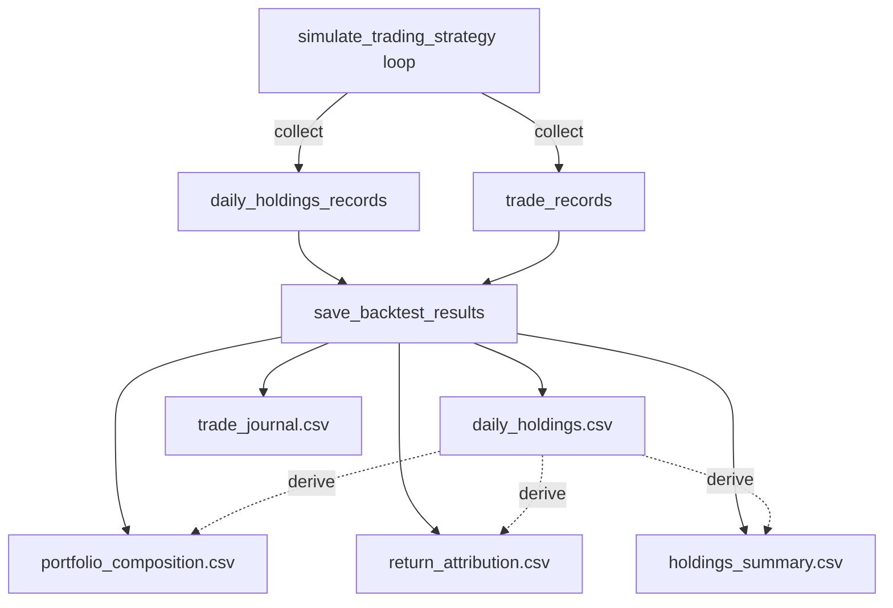

# Portfolio Tracking Outputs Implementation

## Overview

Enhance `[tests/backtest_sp500.py](tests/backtest_sp500.py)` to capture and output detailed portfolio-level data, including which stocks are held each day, when trades occur, and how each stock contributes to returns.

## Current State

The `simulate_trading_strategy()` function (lines 880-1109) already computes:

- `top_stocks` list and `curr_holdings` set (lines 987-988)
- `turnover_info` with `stocks_bought`, `stocks_sold`, `stocks_held` (line 1021)
- Per-stock returns in `top_k_returns` (line 1012)

But all per-stock detail is discarded. Only aggregate daily returns are saved.

## Architecture




## Changes Required

### 1. Data Collection in `simulate_trading_strategy()`

**Location:** Lines 960-1109

**Add tracking lists** after line 972:

```python
daily_holdings_records = []   # Per-stock-per-day details
trade_records = []            # Buy/sell events
```

**Collect holdings data** after computing returns (around line 1018):

```python
# After line 1018 (gross_return = top_k_returns.mean())
# Capture per-stock holdings and returns
for rank, kdcode in enumerate(top_stocks, start=1):
    stock_data = top_k_data[top_k_data['kdcode'] == kdcode]
    if len(stock_data) > 0:
        stock_return = stock_data['open_to_open_return'].iloc[0]
        score = day_preds[day_preds['kdcode'] == kdcode]['score'].iloc[0]
        
        daily_holdings_records.append({
            'pred_date': pred_date,
            'entry_date': entry_date,
            'kdcode': kdcode,
            'rank': rank,
            'score': score,
            'weight': 1.0 / top_k,
            'stock_return': stock_return,
            'contribution': stock_return / top_k
        })
```

**Collect trade data** after turnover calculation (around line 1021):

```python
# After line 1021 (turnover_info = calculate_turnover(...))
# Capture buy/sell events
for kdcode in turnover_info['stocks_bought']:
    score = day_preds[day_preds['kdcode'] == kdcode]['score'].iloc[0] if kdcode in day_preds['kdcode'].values else np.nan
    trade_records.append({
        'date': entry_date,
        'pred_date': pred_date,
        'kdcode': kdcode,
        'action': 'BUY',
        'score': score,
        'rank': top_stocks.index(kdcode) + 1 if kdcode in top_stocks else np.nan
    })

for kdcode in turnover_info['stocks_sold']:
    trade_records.append({
        'date': entry_date,
        'pred_date': pred_date,
        'kdcode': kdcode,
        'action': 'SELL'
    })
```

**Add to return dict** at line 1087:

```python
return {
    # ... existing keys ...
    'daily_holdings': daily_holdings_records,
    'trade_records': trade_records,
}
```

### 2. Output Generation in `save_backtest_results()`

**Location:** Lines 1435-1596

**Add new section** after monthly performance save (around line 1533):

```python
# 6. Save daily holdings log
if sim_results and 'daily_holdings' in sim_results:
    holdings_df = pd.DataFrame(sim_results['daily_holdings'])
    if len(holdings_df) > 0:
        holdings_file = os.path.join(backtest_dir, 'daily_holdings.csv')
        holdings_df.to_csv(holdings_file, index=False)
        print(f"  Daily holdings: {holdings_file}")
        
        # 7. Save trade journal
        trades_df = pd.DataFrame(sim_results['trade_records'])
        if len(trades_df) > 0:
            trades_file = os.path.join(backtest_dir, 'trade_journal.csv')
            trades_df.to_csv(trades_file, index=False)
            print(f"  Trade journal: {trades_file}")
        
        # 8. Derive portfolio composition
        composition_df = derive_portfolio_composition(holdings_df, trades_df)
        comp_file = os.path.join(backtest_dir, 'portfolio_composition.csv')
        composition_df.to_csv(comp_file, index=False)
        print(f"  Portfolio composition: {comp_file}")
        
        # 9. Derive return attribution
        holdings_df['pct_of_portfolio_return'] = (
            holdings_df['contribution'] / 
            holdings_df.groupby('entry_date')['contribution'].transform('sum') * 100
        )
        attribution_file = os.path.join(backtest_dir, 'return_attribution.csv')
        holdings_df[['entry_date', 'kdcode', 'stock_return', 'weight', 
                     'contribution', 'pct_of_portfolio_return']].to_csv(attribution_file, index=False)
        print(f"  Return attribution: {attribution_file}")
        
        # 10. Derive holdings summary statistics
        summary_df = derive_holdings_summary(holdings_df)
        summary_file = os.path.join(backtest_dir, 'holdings_summary.csv')
        summary_df.to_csv(summary_file, index=False)
        print(f"  Holdings summary: {summary_file}")
```

### 3. Helper Functions

**Add before `save_backtest_results()**` (around line 1435):

```python
def derive_portfolio_composition(holdings_df, trades_df):
    """Combine holdings with trade status (NEW/HELD/EXITED)."""
    # Mark new positions
    buys = trades_df[trades_df['action'] == 'BUY'][['date', 'kdcode']].copy()
    buys['status'] = 'NEW'
    
    # Merge with holdings
    comp = holdings_df.merge(
        buys, 
        left_on=['entry_date', 'kdcode'], 
        right_on=['date', 'kdcode'], 
        how='left'
    )
    comp['status'] = comp['status'].fillna('HELD')
    
    return comp[['entry_date', 'kdcode', 'status', 'score', 'stock_return', 'rank']]

def derive_holdings_summary(holdings_df):
    """Aggregate per-stock statistics across entire backtest."""
    summary = holdings_df.groupby('kdcode').agg({
        'score': ['count', 'mean'],
        'stock_return': ['mean', 'sum'],
        'contribution': 'sum'
    }).reset_index()
    
    summary.columns = ['kdcode', 'times_held', 'avg_score', 
                       'avg_return', 'total_return', 'total_contribution']
    
    # Calculate win rate
    win_rate = holdings_df.groupby('kdcode')['stock_return'].apply(
        lambda x: (x > 0).sum() / len(x)
    ).reset_index(name='win_rate')
    
    summary = summary.merge(win_rate, on='kdcode')
    summary = summary.sort_values('total_contribution', ascending=False)
    
    return summary
```

## New Output Files

After implementation, `save_backtest_results()` will produce 5 additional CSV files:

1. **daily_holdings.csv** - Per-stock-per-day detail (pred_date, entry_date, kdcode, rank, score, weight, stock_return, contribution)
2. **trade_journal.csv** - Buy/sell events (date, kdcode, action, score, rank)
3. **portfolio_composition.csv** - Daily portfolio with status flags (entry_date, kdcode, status, score, stock_return, rank)
4. **return_attribution.csv** - Per-stock contribution breakdown (entry_date, kdcode, stock_return, weight, contribution, pct_of_portfolio_return)
5. **holdings_summary.csv** - Per-stock aggregate statistics (kdcode, times_held, avg_score, avg_return, total_contribution, win_rate)

## Testing Strategy

1. Run backtest on small date range (e.g., 10 days)
2. Verify `daily_holdings.csv` matches expected number of rows (days × top_k)
3. Verify `trade_journal.csv` shows first day as all BUYs
4. Spot-check that contributions sum to portfolio return each day
5. Verify no impact on existing outputs (daily_returns.csv, metrics, plots)

## Impact Analysis

**No breaking changes:**

- Existing return calculation logic unchanged
- Existing output files (daily_returns.csv, metrics, plots) unchanged
- New outputs are purely additive
- Backwards compatible with existing calling code

**Performance:**

- Minimal overhead (list appends in existing loop)
- Memory: ~50 KB per 1000 trading days (negligible)

