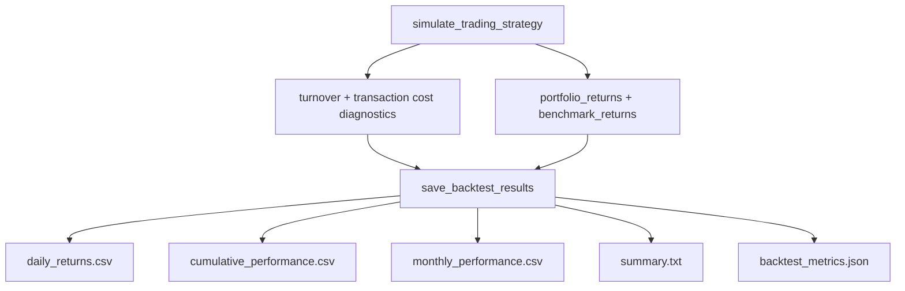

# Portfolio Tracking Outputs Implementation (Updated for Current Repo)

## Why This Plan Was Updated

The previous plan targeted an older version of the backtest implementation. Since then, `tests/backtest_sp500.py` has materially changed:

- Trading simulation now follows fairness-correct timing with `open_to_open_return`.
- Transaction cost support is integrated (`calculate_turnover`, `calculate_transaction_cost`).
- Rank-drop gate behavior is integrated (`rank_drop_gate`).
- Auto-save output flow is centralized in `save_backtest_results()`.

This refreshed plan preserves all of the above while adding portfolio tracking outputs as a purely additive capability.

## Scope and Non-Goals

### In scope

- Add per-stock daily holdings logs from simulation internals.
- Add explicit trade journal rows from turnover decisions.
- Save 5 new CSV outputs under backtest auto-save directory.
- Keep output generation deterministic and aligned with existing simulation dates.

### Out of scope

- No change to return formulas, timing rules, ranking logic, transaction-cost math, or rank-drop gating behavior.
- No changes to existing output files (`backtest_results.csv`, `daily_returns.csv`, `monthly_performance.csv`, etc.).
- No changes to model training, prediction generation, or data splitting.

## Bias and Fairness Guardrails (Critical)

To avoid introducing look-ahead bias:

- Holdings rows must use only the same `entry_date` data already used for realized portfolio returns in simulation.
- Trade records must come from `turnover_info` computed from current/previous holdings only.
- No post-hoc relabeling using future ranks/prices.
- Any derived attribution percentages must be computed within-day from already-realized contribution rows.

To avoid survivorship-like distortions:

- Do not backfill missing ticker-day values with future data.
- If a stock has no valid return row for an entry date, skip that row consistently with existing return selection behavior.

## Current Architecture (as of now)

The new outputs will be attached to this existing flow, not replace it.

## Required Changes

### 1) Simulation data collection in `simulate_trading_strategy()`

Add two collectors near existing tracking arrays:

- `daily_holdings_records = []`
- `trade_records = []`

For each valid simulated trading day:

1. **Holdings capture**
  After `top_k_data` is created and before final append/update steps, emit one row per held stock:
  - `pred_date`
  - `entry_date`
  - `kdcode`
  - `rank` (from `current_ranks`)
  - `score` (from `day_preds`)
  - `weight` (equal-weight, based on count of valid held rows)
  - `stock_return` (`open_to_open_return`)
  - `contribution` (`weight * stock_return`)
  - Optional diagnostics safe to include: `rank_gate_enabled`, `min_rank_drop`, `transaction_costs_enabled`
2. **Trade capture**
  Immediately after turnover is computed (`turnover_info`), append:
  - BUY rows for `stocks_bought`
  - SELL rows for `stocks_sold`
  - Fields: `date` (entry date), `pred_date`, `kdcode`, `action`, `rank`, `score`
3. **Return payload extension**
  Add keys to existing return dict:
  - `daily_holdings`
  - `trade_records`

Do not rename or remove any existing keys in the returned dictionary.

### 2) Derived helper functions before `save_backtest_results()`

Add lightweight helpers:

1. `derive_portfolio_composition(holdings_df, trades_df)`
  - Mark each holding row as `NEW` vs `HELD` using BUY events on the same `entry_date`.
  - Output tidy columns for composition analytics.
2. `derive_holdings_summary(holdings_df)`
  - Aggregate by `kdcode`:
    - `times_held`
    - `avg_score`
    - `avg_return`
    - `total_contribution`
    - `win_rate`
  - Sort by `total_contribution` descending.

Both helpers must be defensive against empty inputs.

### 3) Extend `save_backtest_results()` auto-save section

In the existing `if sim_results:` block, after current core CSV writes:

1. Write `daily_holdings.csv` from `sim_results['daily_holdings']` if present and non-empty.
2. Write `trade_journal.csv` from `sim_results['trade_records']` if present and non-empty.
3. Build and write `portfolio_composition.csv` via helper.
4. Build and write `return_attribution.csv` from holdings rows with within-day attribution percentage:
  - `pct_of_portfolio_return = contribution / sum(contribution for same entry_date) * 100`
5. Build and write `holdings_summary.csv` via helper.

All five files are additive and should not affect existing output writes.

### 4) CLI / multi-model compatibility checks

- Keep behavior unchanged for single-model and multi-model paths.
- Since multi-model save path often omits `sim_results`, new files should only be written when simulation detail is provided.
- No new mandatory CLI arguments.

## File Targets

- Primary implementation target: `tests/backtest_sp500.py`
- Optional test expansion target: `tests/test_backtest_fairness.py` (or a dedicated output test module)
- Optional docs touchpoint (if desired later): `docs/OUTPUT_MANAGEMENT.md`

## New Output Files (Additive)

1. `daily_holdings.csv`
  - Per-stock-per-day holdings facts.
2. `trade_journal.csv`
  - BUY/SELL events inferred from turnover.
3. `portfolio_composition.csv`
  - Holdings rows with state labeling (`NEW` / `HELD`).
4. `return_attribution.csv`
  - Per-stock contribution and percent share of day portfolio return.
5. `holdings_summary.csv`
  - Cross-period per-stock aggregate statistics.

## Validation Strategy

1. Run existing fairness tests first (baseline):
  - `python tests/test_backtest_fairness.py`
2. Run backtest with `--auto_save` on a short window and confirm new files appear.
3. Validate shape checks:
  - `daily_holdings.csv` row count ~= sum(valid held names per trading day)
  - `trade_journal.csv` first day should generally be BUY-only when `prev_holdings is None`
4. Validate accounting checks:
  - For each `entry_date`, `sum(contribution)` should match gross portfolio return for that day (up to float tolerance and missing-row handling).
5. Regression checks:
  - Existing core outputs unchanged in schema and still generated.
  - ARR/ASR/IR unchanged when compared against same commit/config before tracking additions.

## Risks and Mitigations

- **Risk:** Inconsistent weights when fewer than top_k rows survive missing returns.  
**Mitigation:** Derive weight from realized held-row count used in return mean, not fixed `1/top_k` blindly.
- **Risk:** Hidden look-ahead via misaligned date joins in trade/holding enrichment.  
**Mitigation:** Restrict joins to `entry_date`/`pred_date` and same-day predictions only.
- **Risk:** Breaking downstream consumers expecting previous `sim_results` structure.  
**Mitigation:** Only append keys; never remove/rename existing fields.

## Acceptance Criteria

- Backtest runs end-to-end with and without:
  - transaction costs
  - rank-drop gate
  - auto-save
- Five new CSV outputs generated when `sim_results` exists and contain non-empty, coherent data.
- Existing metrics and output files remain intact and unchanged in behavior.
- No new fairness issues introduced (no look-ahead contamination in new artifacts).

