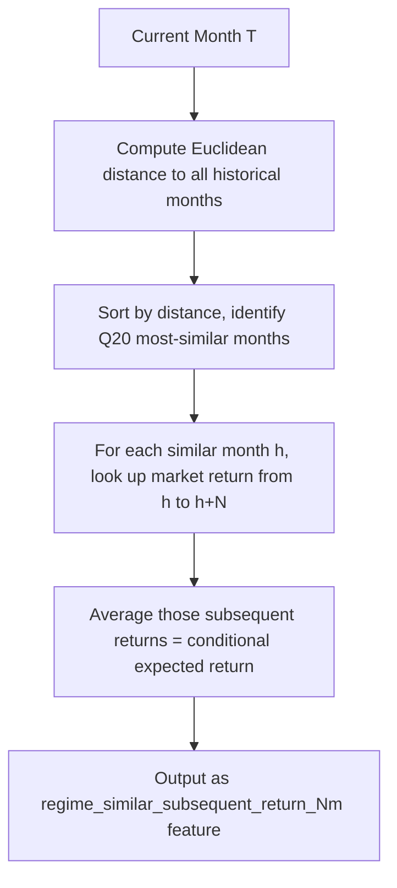

# Regime Feature Enhancement Plan

## Context

The current regime implementation in `[mci_gru/features/regime.py](mci_gru/features/regime.py)` faithfully implements the Harvey/Man AHL similarity-distance methodology but has two gaps:

- Uses 5 of 7 economic state variables (missing monetary policy and volatility)
- Computes "how similar is today to history" but not "what historically happened after similar periods" -- the paper's core investment signal

The model automatically picks up new features via `REGIME_FEATURES` -> `get_feature_columns()` -> `input_size = len(feature_cols)`. No model architecture changes needed.

---

## Part 1: Add Missing Variables (Monetary Policy + Volatility)

### 1a. Update `REGIME_VARIABLES` in `[mci_gru/features/regime.py](mci_gru/features/regime.py)`

Add two new variables to the list:

```python
REGIME_VARIABLES: List[str] = [
    "regime_market",
    "regime_yield_curve",
    "regime_oil",
    "regime_copper",
    "regime_stock_bond_corr",
    "regime_monetary_policy",   # NEW: 3M yield standalone
    "regime_volatility",        # NEW: realized vol / VIX
]
```

This changes the Euclidean distance from 5D to 7D, matching the paper exactly.

### 1b. Update data loading in `[mci_gru/data/data_manager.py](mci_gru/data/data_manager.py)`

In `load_regime_inputs()` API path (non-CSV path):

- `regime_monetary_policy`: already loaded as `yield_3m` from `FRED_SERIES_3M` (DGS3MO) -- just needs to be kept as a standalone column instead of only used for yield curve computation
- `regime_volatility`: add a new FRED series constant `FRED_SERIES_VIX = "VIXCLS"` to `[mci_gru/data/fred_loader.py](mci_gru/data/fred_loader.py)`, load it in the API path

### 1c. Update regime CSV contract

The `regime_inputs_csv` path (used by the seed7 config) requires these columns. Two options:

- **Option A (recommended)**: Make the two new columns optional -- if present in the CSV, use them; if absent, skip them in the distance calculation (already handled by the `valid_mask` logic in `compute_regime_monthly_features`)
- **Option B**: Regenerate `regime_inputs_reconciled.csv` via `[scripts/colab_regime_reconcile.py](scripts/colab_regime_reconcile.py)` to include the two new columns

Option A is safer since it preserves backward compatibility. The `valid_mask` in the distance loop already handles NaN columns gracefully.

### 1d. Update config in `[mci_gru/config.py](mci_gru/config.py)`

Add a new FRED RIC config field:

```python
regime_lseg_vix_ric: str = "VIX"  # or appropriate LSEG RIC
```

---

## Part 2: Subsequent Return After Similar Regimes (Primary Focus)

This is the paper's core signal: after identifying similar historical months, look at what market returns *followed* those months and use that as a predictive feature.

### Methodology




**No look-ahead bias**: For current month T, the similar months h are all in the past. The subsequent returns (h to h+N) are also in the past (since h+N < T by definition -- the exclusion window ensures this). We only look at returns that have already been realized.

### 2a. Compute subsequent returns from the transformed market data

Inside `compute_regime_monthly_features()` in `[mci_gru/features/regime.py](mci_gru/features/regime.py)`:

- Before the main loop, compute forward returns from the `regime_market` column in `monthly_raw` (the raw, untransformed monthly market data):

```python
  market_series = monthly_raw["regime_market"]
  subsequent_returns_1m = market_series.pct_change().shift(-1)  # return from month h to h+1
  subsequent_returns_3m = (market_series.shift(-3) / market_series - 1)  # h to h+3
  

```

- These are precomputed once. When iterating months and identifying similar historical months, index into these arrays to get the returns that followed each similar month.

### 2b. New output features

Add to `REGIME_FEATURES`:

```python
REGIME_FEATURES: List[str] = [
    "regime_global_score",
    "regime_similarity_q20_mean",
    "regime_dissimilarity_q80_mean",
    "regime_similarity_spread",
    "regime_similar_subsequent_return_1m",    # NEW
    "regime_similar_subsequent_return_3m",    # NEW
    "regime_subsequent_return_spread_1m",     # NEW
]
```

- `regime_similar_subsequent_return_1m`: average 1-month market return that followed the Q20 most-similar historical months
- `regime_similar_subsequent_return_3m`: average 3-month market return that followed the Q20 most-similar historical months
- `regime_subsequent_return_spread_1m`: difference between subsequent returns after similar vs. dissimilar months (captures the paper's "long similarity / short dissimilarity" alpha)

### 2c. Implementation detail in the main loop

Inside the existing loop in `compute_regime_monthly_features()`, after computing distances and identifying similar/dissimilar months:

```python
# existing: distances sorted, q_count computed, similar/dissimilar identified
# NEW: look up subsequent returns for those historical months
similar_indices = sorted_indices[:q_count]
dissimilar_indices = sorted_indices[-q_count:]

sim_ret_1m = np.nanmean(subsequent_returns_1m_arr[similar_indices])
sim_ret_3m = np.nanmean(subsequent_returns_3m_arr[similar_indices])
dis_ret_1m = np.nanmean(subsequent_returns_1m_arr[dissimilar_indices])
```

Key change: we need to track which historical indices correspond to which distances. Currently the code discards indices after computing distances. We need to preserve the mapping from `hist_idx` -> `distance` so we can look up which months were most/least similar.

### 2d. Refactor distance computation to preserve indices

The current loop:

```python
distances = []
for hist_idx in range(len(historical)):
    ...
    distances.append(float(np.linalg.norm(diff)))
```

Change to store `(hist_idx, distance)` tuples, then sort by distance:

```python
indexed_distances = []
for hist_idx in range(len(historical)):
    ...
    indexed_distances.append((hist_idx, float(np.linalg.norm(diff))))

indexed_distances.sort(key=lambda x: x[1])
similar_indices = [idx for idx, _ in indexed_distances[:q_count]]
dissimilar_indices = [idx for idx, _ in indexed_distances[-q_count:]]
distances = np.array([d for _, d in indexed_distances])
```

### 2e. Look-ahead safety validation

Critical constraint: for month T at position `idx`, the exclusion window means history ends at `idx - exclusion_months`. Subsequent returns for historical month h use data at h+1 or h+3, which is still before T (since h < idx - exclusion_months). Safe as long as `exclusion_months >= 1` (current default). Add an assertion or documentation noting this.

For the 3-month return: the return from h to h+3 uses data at h+3. As long as h+3 < idx (guaranteed since h < idx - exclusion_months and exclusion_months >= 1), there is no look-ahead. If a subsequent return value is NaN (e.g., for the last few months of the transformed series where h+3 extends beyond available data), `np.nanmean` handles it.

### 2f. Function signature update

Update `compute_regime_monthly_features()` to accept `monthly_raw` (the untransformed data) in addition to the transformed data, so it can compute subsequent returns from actual market levels. Currently `_monthly_transform` is called inside and the raw data is available -- just need to pass it through to the return-lookup code.

Add configurable return horizons:

```python
def compute_regime_monthly_features(
    regime_df: pd.DataFrame,
    ...
    subsequent_return_horizons: List[int] = [1, 3],  # NEW
) -> pd.DataFrame:
```

### 2g. Config additions in `[mci_gru/config.py](mci_gru/config.py)`

```python
regime_subsequent_return_horizons: List[int] = field(default_factory=lambda: [1, 3])
regime_include_subsequent_returns: bool = True
```

Wire through `[mci_gru/features/registry.py](mci_gru/features/registry.py)` `FeatureEngineer` to pass to `compute_regime_monthly_features()`.

---

## Part 3: Feature Registration and Wiring

### 3a. Dynamic feature list in `[mci_gru/features/regime.py](mci_gru/features/regime.py)`

Since the subsequent return features depend on configured horizons, make `REGIME_FEATURES` a function:

```python
def get_regime_features(include_subsequent_returns: bool = True,
                        horizons: List[int] = [1, 3]) -> List[str]:
    features = [
        "regime_global_score",
        "regime_similarity_q20_mean", 
        "regime_dissimilarity_q80_mean",
        "regime_similarity_spread",
    ]
    if include_subsequent_returns:
        for h in horizons:
            features.append(f"regime_similar_subsequent_return_{h}m")
        features.append("regime_subsequent_return_spread_1m")
    return features
```

Keep `REGIME_FEATURES` as the default (all features) for backward compatibility.

### 3b. Update `[mci_gru/features/registry.py](mci_gru/features/registry.py)`

- Update `FeatureEngineer.__init__` to accept the new config params
- Update `transform()` to pass `subsequent_return_horizons` and `regime_include_subsequent_returns` to `add_regime_features()`
- Update `get_feature_columns()` to use the dynamic feature list

### 3c. Backward compatibility

- When `regime_include_subsequent_returns=False` (or for old configs), the feature list and computation remain identical to current behavior
- When the two new variables are missing from CSV, the `valid_mask` logic handles it gracefully (distance computed over available variables only)

---

## Testing Strategy

- Unit test: verify `compute_regime_monthly_features` with `subsequent_return_horizons=[1,3]` produces correct values using synthetic data where subsequent returns are known
- Look-ahead test: verify that for month T, no subsequent return values use data from month T or later
- Integration test: run a short pipeline with `include_global_regime=True` and `regime_include_subsequent_returns=True`, verify model trains without error and feature count matches expectations
- Existing test in `[tests/test_regime_features.py](tests/test_regime_features.py)` should be extended

---

## Files to Modify

- `[mci_gru/features/regime.py](mci_gru/features/regime.py)` -- core implementation (Part 1a, Part 2)
- `[mci_gru/config.py](mci_gru/config.py)` -- new config fields (Part 1d, 2g)
- `[mci_gru/data/data_manager.py](mci_gru/data/data_manager.py)` -- data loading for new variables (Part 1b)
- `[mci_gru/data/fred_loader.py](mci_gru/data/fred_loader.py)` -- VIX FRED series constant (Part 1b)
- `[mci_gru/features/registry.py](mci_gru/features/registry.py)` -- feature wiring (Part 3b)
- `[tests/test_regime_features.py](tests/test_regime_features.py)` -- extended tests

