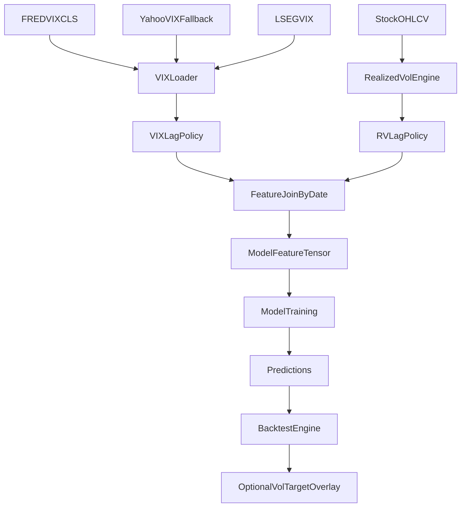

# Volatility Integration + VIX Fix Plan

## Objectives

- Stabilize and de-risk VIX ingestion so `include_vix` works reliably for CSV and LSEG workflows.
- Add complementary volatility signals (fast, slow, vol-ratio, vol-of-vol, VRP proxy) to augment existing VIX features.
- Preserve backward compatibility and avoid regressions in existing experiments.
- Enforce anti-leakage/anti-bias constraints (strict lagging, no future-aware imputation, no survivorship creep).

## Current-State Findings To Address

- VIX path for CSV depends on a missing local file (`vix_data.csv`), causing `include_vix` runs to fail despite warning messaging.
- VIX feature filling currently uses broad forward-fill/defaults that can hide data issues.
- Realized volatility feature imputation uses full-sample stock medians for early windows, which can leak future information.
- No dedicated volatility/VIX unit tests currently protect these pathways.

## Implementation Phases

### Phase 1: VIX Ingestion Reliability + Timing Safety

- Extend data loading to support VIX from FRED first (series `VIXCLS`) and optional yfinance fallback (`^VIX`), with existing LSEG path retained.
- Standardize VIX schema to `[dt, vix]` and explicit date alignment policy before merge.
- Apply point-in-time-safe lag policy for VIX (default `lag_days=1`) before feature derivation.
- Add config toggles for source preference and lag policy while keeping defaults backward-compatible.
- Implement strict/soft-fail behavior consistently:
  - strict mode: fail if `include_vix=true` and VIX unavailable
  - soft mode: inject neutral placeholders plus warning telemetry

Key files:

- [c:/Users/magil/Current_MCI_GRU/MCI-GRU-1/mci_gru/data/data_manager.py](c:/Users/magil/Current_MCI_GRU/MCI-GRU-1/mci_gru/data/data_manager.py)
- [c:/Users/magil/Current_MCI_GRU/MCI-GRU-1/mci_gru/data/fred_loader.py](c:/Users/magil/Current_MCI_GRU/MCI-GRU-1/mci_gru/data/fred_loader.py)
- [c:/Users/magil/Current_MCI_GRU/MCI-GRU-1/mci_gru/data/lseg_loader.py](c:/Users/magil/Current_MCI_GRU/MCI-GRU-1/mci_gru/data/lseg_loader.py)
- [c:/Users/magil/Current_MCI_GRU/MCI-GRU-1/mci_gru/features/volatility.py](c:/Users/magil/Current_MCI_GRU/MCI-GRU-1/mci_gru/features/volatility.py)
- [c:/Users/magil/Current_MCI_GRU/MCI-GRU-1/mci_gru/config.py](c:/Users/magil/Current_MCI_GRU/MCI-GRU-1/mci_gru/config.py)

### Phase 2: Realized Volatility Feature Upgrade (Fast + Slow)

- Keep existing per-stock realized vol features, but replace leakage-prone early-window filling with causal alternatives.
- Add market-level realized volatility features computed from aggregate market return series:
  - `realized_vol_fast` (e.g., 21d annualized)
  - `realized_vol_slow` (e.g., 252d annualized)
  - `realized_vol_ratio` (`fast/slow`, clipped)
  - `realized_vol_of_vol` (rolling std of fast vol)
- All rolling signals generated with `min_periods` and lag applied before use in prediction month/day.
- Merge as date-level broadcasted features across stocks, similar to VIX.

Key files:

- [c:/Users/magil/Current_MCI_GRU/MCI-GRU-1/mci_gru/features/volatility.py](c:/Users/magil/Current_MCI_GRU/MCI-GRU-1/mci_gru/features/volatility.py)
- [c:/Users/magil/Current_MCI_GRU/MCI-GRU-1/mci_gru/features/registry.py](c:/Users/magil/Current_MCI_GRU/MCI-GRU-1/mci_gru/features/registry.py)

### Phase 3: Implied-vs-Realized Complement Features (VIX + RV)

- Add cross-signal features that encode regime dislocations:
  - `vrp_spread = vix - realized_vol_fast`
  - `vrp_ratio = vix / realized_vol_fast`
  - optional z-scored versions from training-only stats
- Add optional risk-throttle proxy feature:
  - `target_risk_leverage_proxy = target_vol / realized_vol_fast` (clipped)
- Keep these as model inputs only in this phase (no direct portfolio scaling yet).

Key files:

- [c:/Users/magil/Current_MCI_GRU/MCI-GRU-1/mci_gru/features/volatility.py](c:/Users/magil/Current_MCI_GRU/MCI-GRU-1/mci_gru/features/volatility.py)
- [c:/Users/magil/Current_MCI_GRU/MCI-GRU-1/mci_gru/features/registry.py](c:/Users/magil/Current_MCI_GRU/MCI-GRU-1/mci_gru/features/registry.py)
- [c:/Users/magil/Current_MCI_GRU/MCI-GRU-1/configs/features/full.yaml](c:/Users/magil/Current_MCI_GRU/MCI-GRU-1/configs/features/full.yaml)

### Phase 4: Portfolio-Level Vol Target Overlay (Optional, Backtest Layer)

- Add optional portfolio risk scaling in backtest/eval pipeline:
  - Compute realized portfolio vol estimator from historical realized returns.
  - Apply `leverage_t = target_vol / est_vol_t`, clipped to bounds.
  - Use lagged estimator (`t` determines exposure for `t+1`) to prevent look-ahead.
- Compare three modes:
  - no overlay (baseline)
  - slow estimator overlay
  - fast estimator overlay

Key files:

- [c:/Users/magil/Current_MCI_GRU/MCI-GRU-1/tests/backtest_sp500.py](c:/Users/magil/Current_MCI_GRU/MCI-GRU-1/tests/backtest_sp500.py)

### Phase 5: Config, Experiment Matrix, and Documentation

- Add explicit feature toggles and defaults in config schema.
- Add experiment presets for:
  - `with_vix_fixed`
  - `with_realized_vol`
  - `with_vix_plus_realized_vol`
  - `with_vix_plus_realized_vol_plus_overlay`
- Document source/lag policy and bias controls in guides.

Key files:

- [c:/Users/magil/Current_MCI_GRU/MCI-GRU-1/mci_gru/config.py](c:/Users/magil/Current_MCI_GRU/MCI-GRU-1/mci_gru/config.py)
- [c:/Users/magil/Current_MCI_GRU/MCI-GRU-1/configs/experiment/with_vix.yaml](c:/Users/magil/Current_MCI_GRU/MCI-GRU-1/configs/experiment/with_vix.yaml)
- [c:/Users/magil/Current_MCI_GRU/MCI-GRU-1/docs/CONFIGURATION_GUIDE.md](c:/Users/magil/Current_MCI_GRU/MCI-GRU-1/docs/CONFIGURATION_GUIDE.md)
- [c:/Users/magil/Current_MCI_GRU/MCI-GRU-1/docs/QUICK_REFERENCE.md](c:/Users/magil/Current_MCI_GRU/MCI-GRU-1/docs/QUICK_REFERENCE.md)

### Phase 6: Test Coverage and Verification

- Add targeted unit/integration tests for:
  - VIX load success paths (FRED/LSEG/fallback)
  - include_vix behavior under strict/soft-fail
  - lag correctness (`signal_t` only impacts `t+1`)
  - no future-aware fill behavior for vol features
  - feature column consistency under optional components
- Add regression checks to ensure existing non-volatility experiments remain unchanged.

Likely test files:

- [c:/Users/magil/Current_MCI_GRU/MCI-GRU-1/tests/test_regime_features.py](c:/Users/magil/Current_MCI_GRU/MCI-GRU-1/tests/test_regime_features.py) (pattern reference)
- [c:/Users/magil/Current_MCI_GRU/MCI-GRU-1/tests/test_backtest_fairness.py](c:/Users/magil/Current_MCI_GRU/MCI-GRU-1/tests/test_backtest_fairness.py)
- new: `tests/test_volatility_features.py`, `tests/test_vix_loading.py`

## Data/Signal Flow (Target Architecture)

## Bias and Risk Controls (Must-Have)

- No look-ahead: all rolling statistics are trailing only, then lagged before usage.
- No survivorship expansion from volatility sources; volatility inputs remain market-level time series.
- No full-sample imputation for early-period features.
- Explicit logs for missing macro/volatility data and fallback usage.

## Acceptance Criteria

- `include_vix=true` works under CSV workflow without requiring manual local `vix_data.csv`.
- Volatility features are generated causally and pass leakage-focused tests.
- New features are optional and do not alter outputs when disabled.
- Experiment configs can isolate incremental contribution of each volatility component.
- Backtest overlay (if enabled) is lag-correct and reproducible.

