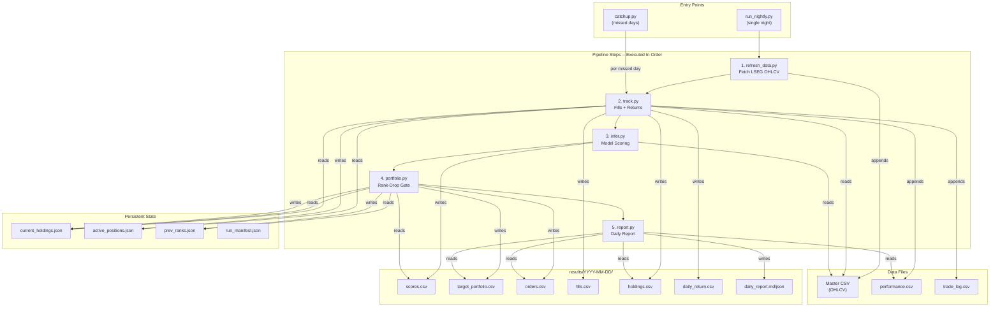
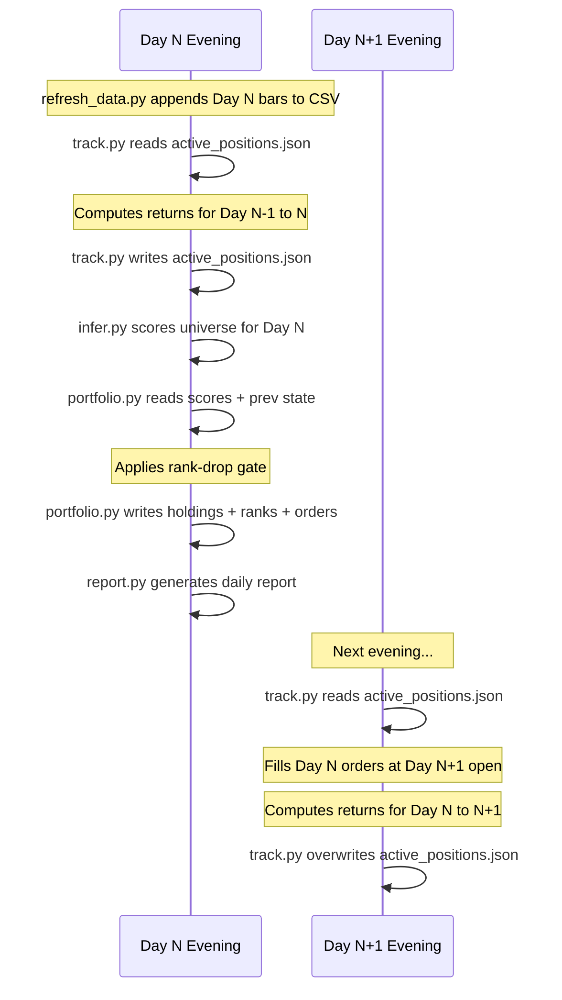

# MCI-GRU Paper Trading System -- Complete Architecture Reference

---

## 1. High-Level Architecture

The system is a nightly batch pipeline that: fetches market data, tracks execution of prior orders, runs a neural network (MCI-GRU) to score all S&P 500 stocks, makes portfolio decisions via a rank-drop gate, and generates daily reports.




---

## 2. Entry Points

### 2a. `run_nightly.py` -- Single Night Orchestrator

**File:** [paper_trade/scripts/run_nightly.py](paper_trade/scripts/run_nightly.py)

**Purpose:** Runs the complete 5-step pipeline for one trading day.

**Step execution order** is defined at lines 36-67:

```36:67:paper_trade/scripts/run_nightly.py
STEPS = [
    {
        "name": "Data Refresh",
        "script": "refresh_data.py",
        "phase": 2,
        "skippable": True,
    },
    // ... track.py, infer.py, portfolio.py, report.py
]
```

- Data Refresh is the only `skippable: True` step -- if it fails, the pipeline continues
- All other steps abort the pipeline on failure (line 265)

**Subprocess execution** at lines 79-161 via `run_step()`:

- Each script runs as a child process with 10-minute timeout (line 116)
- stdout is printed live; stderr is shown on failure (lines 120-129)
- Returns a status dict (`OK`, `FAILED`, `TIMEOUT`, `ERROR`)

**Skip flags** at lines 237-255:

- `--skip-refresh`: bypasses `refresh_data.py` (use when CSV is current)
- `--skip-track`: bypasses `track.py` (use on first run with no prior positions)

**Manifest** written at lines 164-181 to `paper_trade/state/run_manifest.json` recording start/end times, step statuses, and overall pass/fail.

**CLI:**

```
python paper_trade/scripts/run_nightly.py
python paper_trade/scripts/run_nightly.py --skip-refresh
python paper_trade/scripts/run_nightly.py --skip-track --skip-refresh
python paper_trade/scripts/run_nightly.py --dry-run
```

---

### 2b. `catchup.py` -- Multi-Day Catch-Up

**File:** [paper_trade/scripts/catchup.py](paper_trade/scripts/catchup.py)

**Purpose:** When you miss multiple trading days, processes each in chronological order.

**How it identifies missed days** at lines 130-164:

1. Reads the last processed date from `current_holdings.json` (line 130 calls `get_last_processed_date()` at lines 43-50)
2. Queries the master CSV for all trading dates strictly after that date (line 156 calls `get_trading_dates_after()` at lines 53-57)
3. Each missed day runs the 4-step sub-pipeline: `track -> infer -> portfolio -> report` (line 35-40, iterated at lines 168-191)

**Key difference from `run_nightly.py`:**

- Data refresh runs **once** at the start (not per day)
- Each script receives `--date <trade_date>` so it processes the correct historical day (line 177)
- State files update sequentially so day N's output feeds day N+1's input

**Abort behavior** at lines 184-191: if any step fails for a day, the entire catchup stops.

---

## 3. Pipeline Step 1: Data Refresh

**File:** [paper_trade/scripts/refresh_data.py](paper_trade/scripts/refresh_data.py)

**Purpose:** Incrementally fetch new OHLCV bars from LSEG (Refinitiv) and append to the master CSV.

**Constants** at lines 29-35:

- `BATCH_SIZE = 50` -- RICs per API call
- `BATCH_DELAY = 2.0` -- seconds between batches
- `MAX_RETRIES = 3` with `RETRY_BACKOFF = 4.0` seconds
- `MIN_COVERAGE_DEFAULT = 0.80` -- minimum fraction of RICs that must return data
- `FETCH_LOOKBACK_DAYS = 7` -- extra days fetched to handle LSEG reliability gaps
- `BENCHMARK_RIC = "SPY.P"` -- always included in the fetch

**Date range computation** at lines 295-304:

- Normal mode: `fetch_start = last_date_in_CSV + 1 day`
- `--force` mode: re-fetches from the last existing date (for repairing partial fetches)
- API start is shifted back 7 days for reliability: `api_start = fetch_start - 7 days`

**Two-pass download** in `download_incremental()` at lines 87-165:

- **Pass 1** (lines 100-131): Batch download in groups of 50 RICs with up to 3 retries per batch
- **Pass 2** (lines 133-163): Any still-missing RICs are retried in micro-batches of 10

**Reshape** in `reshape_to_standard()` at lines 168-201:

- Converts LSEG MultiIndex DataFrame to flat format: `[kdcode, dt, open, high, low, close, volume, turnover]`
- Computes `turnover = volume * close` (line 198)
- Deduplicates on `(kdcode, dt)` keeping first (line 197)

**Coverage gate** at lines 348-359: If fewer than 80% of RICs returned data, the script aborts to prevent corrupt data.

**Merge and save** at lines 381-398: Appends new rows to master CSV, deduplicates keeping latest, sorts by `(kdcode, dt)`.

**Master CSV:** `data/raw/market/sp500_2019_universe_data_through_2026.csv`
**Constituents:** `data/raw/constituents/sp500_constituents_2019.csv`

---

## 4. Pipeline Step 2: Execution Tracker

**File:** [paper_trade/scripts/track.py](paper_trade/scripts/track.py)

**Purpose:** Two responsibilities -- (1) record fill prices for yesterday's orders at today's open, (2) compute open-to-open returns for positions held overnight.

**Constants** at lines 32-35:

- `BENCHMARK_TICKER = "SPY.P"`
- `SLIPPAGE_BPS = 5`, `BID_ASK_BPS = 5` (10 bps total per side)

### Date Resolution (lines 355-367)

```355:367:paper_trade/scripts/track.py
    recent_dates = get_trading_dates(str(csv_path), n_recent=5)
    // ...
    today = args.date or recent_dates[-1]
    if len(recent_dates) >= 2:
        yesterday = recent_dates[-2] if today == recent_dates[-1] else None
        if yesterday is None:
            idx = recent_dates.index(today) if today in recent_dates else -1
            yesterday = recent_dates[idx - 1] if idx > 0 else None
    else:
        yesterday = None
```

- `today` = explicit `--date` or the latest date in the CSV
- `yesterday` = the trading day immediately before `today` (handles weekends/holidays)

### State Loading (lines 372-373)

```372:373:paper_trade/scripts/track.py
    holdings_state = load_state(state_dir)
    prev_positions = load_fill_state(state_dir)
```

- `holdings_state` from `current_holdings.json`: the target portfolio from last night's `portfolio.py`
- `prev_positions` from `active_positions.json`: positions with entry metadata from last night's `track.py`

### Fill Computation -- `compute_fills()` (lines 77-113)

```94:103:paper_trade/scripts/track.py
    price_map = open_prices[open_prices["dt"] == fill_date].set_index("kdcode")["open"].to_dict()

    records = []
    for _, row in orders.iterrows():
        kd = row["kdcode"]
        records.append({
            "kdcode": kd,
            "dt": fill_date,
            "side": row["side"],
            "fill_price": round(price_map.get(kd, np.nan), 4),
            // ...
```

- Reads orders from `results/<decision_date>/orders.csv` (line 397)
- Fill price = today's open price from the master CSV
- Output: `results/<today>/fills.csv`

### Return Computation -- `compute_daily_returns()` (lines 116-172)

```148:149:paper_trade/scripts/track.py
        ret = (open_curr / open_prev) - 1.0
        contribution = ret * weight
```

- For each position in `prev_positions`, computes `open(today) / open(yesterday) - 1`
- Portfolio return = **equal-weighted mean** of individual stock returns (line 166)
- This matches the backtest convention in `backtest_sp500.py` lines 726-731

### Benchmark Return -- `compute_benchmark_return()` (lines 175-194)

```192:194:paper_trade/scripts/track.py
    if prev.empty or curr.empty or prev.iloc[0] == 0:
        return np.nan
    return float((curr.iloc[0] / prev.iloc[0]) - 1.0)
```

- SPY.P open-to-open return over the same period
- Returns `NaN` if SPY price is missing for either date

### Performance CSV Update -- `update_performance_csv()` (lines 197-261)

```209:214:paper_trade/scripts/track.py
    cost_per_side = (BID_ASK_BPS + SLIPPAGE_BPS) / 10_000
    est_cost = turnover * cost_per_side * 2

    net_return = portfolio_return - est_cost
    bm_safe = benchmark_return if not np.isnan(benchmark_return) else 0.0
    excess_return = portfolio_return - bm_safe
```

- Transaction cost model: `turnover * 10 bps * 2 sides`
- Net return = gross return minus estimated cost
- Handles NaN benchmark gracefully (defaults to 0.0, line 213)
- Handles NaN in previous cumulative benchmark (line 232-233)
- Appends row to `results/performance.csv` with columns: `dt, daily_return, net_return, benchmark_return, excess_return, cum_return, cum_benchmark, equity, peak_equity, drawdown, turnover, est_cost, num_trades, num_holdings`

### Turnover Calculation (lines 422-427)

```422:427:paper_trade/scripts/track.py
            prev_held = set(p["kdcode"] for p in prev_positions.get("positions", []))
            curr_held = set(h["kdcode"] for h in holdings)
            sold = prev_held - curr_held
            bought = curr_held - prev_held
            top_k = len(holdings) if holdings else 20
            turnover = (len(sold) + len(bought)) / (2 * top_k)
```

- One-way turnover: `(stocks_sold + stocks_bought) / (2 * portfolio_size)`

### Active Positions Update -- `build_active_positions()` (lines 281-316)

```312:316:paper_trade/scripts/track.py
    return {
        "fill_date": fill_date,
        "decision_date": holdings_state.get("date"),
        "positions": positions,
    }
```

- Builds the position snapshot that will be used **tomorrow** to compute returns
- Saved to `active_positions.json` (line 407)

### Outputs per day:

- `results/<today>/fills.csv`
- `results/<today>/holdings.csv`
- `results/<today>/daily_return.csv`
- `results/performance.csv` (appended)
- `results/trade_log.csv` (appended)
- `state/active_positions.json` (overwritten)

---

## 5. Pipeline Step 3: Model Inference

**File:** [paper_trade/scripts/infer.py](paper_trade/scripts/infer.py)

**Purpose:** Run frozen MCI-GRU checkpoints to produce a score for every stock in the universe.

**Model location** at line 40: `paper_trade/Model/Seed73_trained_to_2062026`

### Model Loading (lines 45-58)

```45:58:paper_trade/scripts/infer.py
def load_metadata(model_dir: Path) -> dict:
    meta_path = model_dir / "run_metadata.json"
    // ...

def load_config(model_dir: Path) -> dict:
    cfg_path = model_dir / "config.yaml"
    // ...
    cfg = OmegaConf.load(str(cfg_path))
    return OmegaConf.to_container(cfg, resolve=True)
```

- `run_metadata.json`: contains `feature_cols`, `kdcode_list`, `norm_means`, `norm_stds`, `his_t` (lookback window length)
- `config.yaml`: model architecture config and feature engineering settings

### Feature Engineering (lines 61-100, 122-123)

```122:123:paper_trade/scripts/infer.py
    feature_engineer = build_feature_engineer(features_cfg)
    df = feature_engineer.transform(df, None, None, None)
```

- Uses `mci_gru.features.FeatureEngineer` with the same config as training
- Supports momentum (binary/blended), volatility, VIX, credit spread, regime, RSI, MA, price, and volume features (lines 63-100)

### Data Preparation -- `prepare_inference_data()` (lines 103-208)

**NaN handling** at lines 157-166:

```157:166:paper_trade/scripts/infer.py
    grouped = df_window.groupby("dt")
    filled_parts = []
    for dt_val, df_day in grouped:
        df_day = df_day.copy()
        for col in feature_cols:
            if col in df_day.columns:
                df_day[col] = df_day[col].fillna(df_day[col].mean())
        df_day = df_day.fillna(0.0)
        filled_parts.append(df_day)
```

- Per-day cross-sectional mean imputation for each feature column
- Remaining NaNs filled with 0.0

**Normalization** at lines 169-173:

```169:173:paper_trade/scripts/infer.py
    for col in feature_cols:
        if col in df_window.columns:
            m, s = means[col], stds[col]
            df_window[col] = np.clip(df_window[col], m - 3 * s, m + 3 * s)
            df_window[col] = (df_window[col] - m) / s
```

- Uses **saved training statistics** (not live stats) for normalization
- Clips to +/- 3 standard deviations before z-scoring

**Tensor construction** at lines 175-207:

- Time series tensor: shape `(1, n_stocks, his_t, n_features)` -- lookback window of `his_t` days (lines 180-192)
- Graph features tensor: shape `(1, n_stocks, n_features)` -- single day snapshot for graph input (lines 194-202)

### Forward Pass -- `run_inference()` (lines 211-268)

```230:231:paper_trade/scripts/infer.py
    graph_data = torch.load(str(graph_data_path), weights_only=True)
    edge_index = graph_data["edge_index"].to(device)
```

- Loads `graph_data.pt` containing the stock correlation graph (edge_index + edge_weight)
- Iterates over all checkpoint files in `checkpoints/model_*_best.pth` (line 244)
- Each checkpoint: load weights, run forward pass, collect predictions (lines 251-264)
- Final score = **average across all checkpoints** (line 266)

### Score Output -- `save_scores()` (lines 271-299)

```280:286:paper_trade/scripts/infer.py
    df = pd.DataFrame({
        "kdcode": kdcode_list,
        "dt": pred_date,
        "score": np.round(scores, 5),
    })
    df = df.sort_values("score", ascending=False).reset_index(drop=True)
    df["rank"] = np.arange(1, len(df) + 1)
```

- Output: `results/<date>/scores.csv` with columns `kdcode, dt, score, rank`
- Rank 1 = highest score (most bullish prediction)

---

## 6. Pipeline Step 4: Portfolio Decision Engine

**File:** [paper_trade/scripts/portfolio.py](paper_trade/scripts/portfolio.py)

**Purpose:** Apply the rank-drop gate to decide which stocks to hold, exit, or enter.

**Default parameters** at lines 30-31:

- `TOP_K = 20` -- number of stocks to hold
- `MIN_RANK_DROP = 30` -- exit threshold

### Rank-Drop Gate -- `apply_rank_drop_gate()` (lines 100-181)

This is the core trading logic:

**Initial run** (lines 115-124): If no prior holdings exist, simply take the top-K stocks by score.

**Subsequent runs** (lines 126-181):

```133:151:paper_trade/scripts/portfolio.py
    for kdcode in current_held:
        prev_rank = prev_ranks.get(kdcode)
        curr_rank = current_ranks.get(kdcode)

        if prev_rank is None or curr_rank is None:
            survivors.append(kdcode)
            continue

        rank_drop = curr_rank - prev_rank
        if rank_drop >= min_rank_drop:
            exits.append(kdcode)
            exit_details.append({...})
        else:
            survivors.append(kdcode)
```

- For each currently held stock, compare today's rank to yesterday's rank
- If rank dropped by >= 30 positions (e.g., rank 5 to rank 35), **exit the position**
- Otherwise the stock **survives** (stays in portfolio regardless of absolute rank)
- Stocks that disappeared from the scored universe are also exited (lines 153-163)

**Refill logic** at lines 165-172:

```165:172:paper_trade/scripts/portfolio.py
    survivor_set = set(survivors)
    refill_candidates = [
        kd for kd in scores_df["kdcode"].tolist()
        if kd not in survivor_set
    ]
    slots_needed = max(0, top_k - len(survivors))
    new_entries = refill_candidates[:slots_needed]
    target_stocks = survivors + new_entries
```

- Empty slots (from exits) are filled with the **highest-ranked stocks** not already held
- Final portfolio = survivors + new entries

### Portfolio Construction -- `build_target_portfolio()` (lines 184-213)

```191:191:paper_trade/scripts/portfolio.py
    weight = 1.0 / len(target_stocks) if target_stocks else 0.0
```

- **Equal weighting**: each stock gets `1/20 = 5.0%` weight
- Entry dates are preserved for survivors (line 199), set to today for new entries

### Order Generation -- `build_orders()` (lines 216-247)

- Generates SELL orders for exits with reason string (e.g., `"rank_drop 17->60 (+43)"`)
- Generates BUY orders for new entries with reason `"new_entry"` or `"initial_fill"`

### State Persistence (lines 368-379)

```377:379:paper_trade/scripts/portfolio.py
    current_ranks = scores_df.set_index("kdcode")["rank"].to_dict()
    current_ranks = {k: int(v) for k, v in current_ranks.items()}
    save_state(state_dir, pred_date, current_holdings, current_ranks)
```

- Saves `current_holdings.json`: date + list of holdings with kdcode, entry_date, entry_rank, weight
- Saves `prev_ranks.json`: date + **full rank table** for all scored stocks (used next day for rank-drop comparison)

### Outputs per day:

- `results/<date>/target_portfolio.csv`
- `results/<date>/orders.csv`
- `state/current_holdings.json` (overwritten)
- `state/prev_ranks.json` (overwritten)

---

## 7. Pipeline Step 5: Daily Report

**File:** [paper_trade/scripts/report.py](paper_trade/scripts/report.py)

**Purpose:** Consume all pipeline outputs and generate a human-readable markdown report + equity chart.

### Data Loading (lines 377-381)

```377:381:paper_trade/scripts/report.py
    perf_df = load_csv_safe(results_dir / "performance.csv")
    target_portfolio = load_csv_safe(day_dir / "target_portfolio.csv")
    orders = load_csv_safe(day_dir / "orders.csv")
    holdings = load_csv_safe(day_dir / "holdings.csv")
    daily_return = load_csv_safe(day_dir / "daily_return.csv")
```

### Rolling Statistics -- `compute_rolling_stats()` (lines 38-72)

```50:58:paper_trade/scripts/report.py
    returns = perf_df["net_return"].values
    // ...
    lookback = min(window, n)
    recent = returns[-lookback:]
    vol = np.std(recent, ddof=1) if lookback > 1 else 0.0
    vol_ann = vol * np.sqrt(TRADING_DAYS_PER_YEAR)
    mean_ret = np.mean(recent)
    sharpe = (mean_ret / vol * np.sqrt(TRADING_DAYS_PER_YEAR)) if vol > 0 else 0.0
```

- 20-day rolling window (or all available if fewer than 20 days)
- Annualized vol: `daily_vol * sqrt(252)`
- Sharpe proxy: `(mean_daily / daily_vol) * sqrt(252)` -- no risk-free rate subtracted
- Max drawdown: minimum of the `drawdown` column across all history
- Win rate: fraction of positive-return days

### Report Sections (lines 125-290 in `build_markdown_report()`):

1. **Performance** (lines 143-171): Today's return, benchmark, excess, cumulative, equity, drawdown. Uses `_fmt_pct()` helper (lines 152-157) to show "N/A" for missing benchmark data.
2. **Rolling Statistics** (lines 173-201): Vol, Sharpe, max DD, win rate, avg daily return
3. **Portfolio Holdings** (lines 203-235): Per-stock rank, score, weight, day return, contribution, entry date. Merges `target_portfolio.csv` with `holdings.csv` return data (lines 210-214).
4. **Changes** (lines 237-268): Lists exits and new entries from `orders.csv`
5. **Trading Stats** (lines 270-284): Trade count, turnover, cost, holdings count

### Equity Chart -- `generate_equity_chart()` (lines 75-122)

```93:93:paper_trade/scripts/report.py
    bm_equity = np.cumprod(1.0 + perf_df["benchmark_return"].values)
```

- Top panel: portfolio equity curve vs benchmark equity (cumulative product of returns)
- Bottom panel: drawdown area chart
- Saved to `results/equity_curve.png`

### Outputs:

- `results/<date>/daily_report_<date>.md`
- `results/<date>/daily_report_<date>.json`
- `results/equity_curve.png` (overwritten each run)

---

## 8. State Files Reference

### `state/current_holdings.json`

- **Written by:** `portfolio.py` (line 89)
- **Read by:** `track.py` (line 47), `portfolio.py` (line 63), `catchup.py` (line 48)
- **Schema:** `{"date": "YYYY-MM-DD", "holdings": [{"kdcode", "entry_date", "entry_rank", "weight"}, ...]}`
- **Role:** The "source of truth" for what the portfolio currently holds

### `state/active_positions.json`

- **Written by:** `track.py` (line 66)
- **Read by:** `track.py` (line 59)
- **Schema:** `{"fill_date": "YYYY-MM-DD", "decision_date": "YYYY-MM-DD", "positions": [{"kdcode", "weight", "entry_date", "fill_price"}, ...]}`
- **Role:** Snapshot of positions used to compute next day's returns. Links the portfolio decision to the actual tracked positions.

### `state/prev_ranks.json`

- **Written by:** `portfolio.py` (line 96)
- **Read by:** `portfolio.py` (line 66)
- **Schema:** `{"date": "YYYY-MM-DD", "ranks": {"INTC.OQ": 1, "NVDA.OQ": 2, ...}}`
- **Role:** Full rank table from yesterday, used by the rank-drop gate to measure rank deterioration

### `state/run_manifest.json`

- **Written by:** `run_nightly.py` (line 178), `catchup.py` (line 232)
- **Schema:** `{"run_start", "run_end", "python", "steps": [...], "all_ok": bool}`
- **Role:** Audit trail of the last pipeline execution

---

## 9. Data Flow Across Days




**The critical handoff:**

1. `portfolio.py` on Day N writes `orders.csv` and updates `current_holdings.json`
2. `track.py` on Day N+1 reads those orders, looks up today's open price, records fills
3. `track.py` on Day N+1 uses `active_positions.json` (written by Day N's `track.py`) to compute the overnight return
4. `track.py` on Day N+1 builds new `active_positions.json` from the current holdings for Day N+2's return computation

---

## 10. Key Formulas

- **Stock return:** `open(today) / open(yesterday) - 1` ([track.py line 148](paper_trade/scripts/track.py))
- **Portfolio return:** `mean(stock_returns)` -- equal-weighted ([track.py line 166](paper_trade/scripts/track.py))
- **Transaction cost:** `turnover * (5 + 5) / 10000 * 2` = turnover * 20 bps round-trip ([track.py lines 209-210](paper_trade/scripts/track.py))
- **Net return:** `portfolio_return - est_cost` ([track.py line 212](paper_trade/scripts/track.py))
- **Equity:** `prev_equity * (1 + net_return)` -- compounding ([track.py line 237](paper_trade/scripts/track.py))
- **Drawdown:** `equity / peak_equity - 1` ([track.py line 239](paper_trade/scripts/track.py))
- **Turnover:** `(stocks_sold + stocks_bought) / (2 * top_k)` ([track.py lines 424-427](paper_trade/scripts/track.py))
- **Rank drop:** `curr_rank - prev_rank` -- exit if >= 30 ([portfolio.py lines 141-142](paper_trade/scripts/portfolio.py))
- **Sharpe proxy:** `(mean_daily / std_daily) * sqrt(252)` ([report.py line 58](paper_trade/scripts/report.py))

---

## 11. File System Layout

```
paper_trade/
  scripts/
    run_nightly.py          # Main entry point (nightly)
    catchup.py              # Multi-day catch-up
    refresh_data.py         # LSEG data fetch
    track.py                # Fills + returns
    infer.py                # Model inference
    portfolio.py            # Rank-drop gate + orders
    report.py               # Daily report generation
    diag_lseg.py            # LSEG API diagnostic (standalone)
  state/
    current_holdings.json   # Current portfolio (portfolio.py -> track.py, portfolio.py)
    active_positions.json   # Position tracking (track.py -> track.py)
    prev_ranks.json         # Yesterday's ranks (portfolio.py -> portfolio.py)
    run_manifest.json       # Pipeline audit trail
  results/
    performance.csv         # Cumulative daily performance (track.py appends)
    trade_log.csv           # All historical fills (track.py appends)
    equity_curve.png        # Latest equity chart (report.py overwrites)
    YYYY-MM-DD/
      scores.csv            # Model scores (infer.py)
      target_portfolio.csv  # Target holdings (portfolio.py)
      orders.csv            # Buy/sell orders (portfolio.py)
      fills.csv             # Executed fills (track.py)
      holdings.csv          # Holdings with returns (track.py)
      daily_return.csv      # Day's return summary (track.py)
      daily_report_*.md     # Human report (report.py)
      daily_report_*.json   # Machine report (report.py)
  Model/
    Seed73_trained_to_2062026/
      run_metadata.json     # Feature cols, normalization stats, kdcode list
      config.yaml           # Model + feature config
      graph_data.pt         # Stock correlation graph
      checkpoints/
        model_*_best.pth    # Frozen model weights
```

