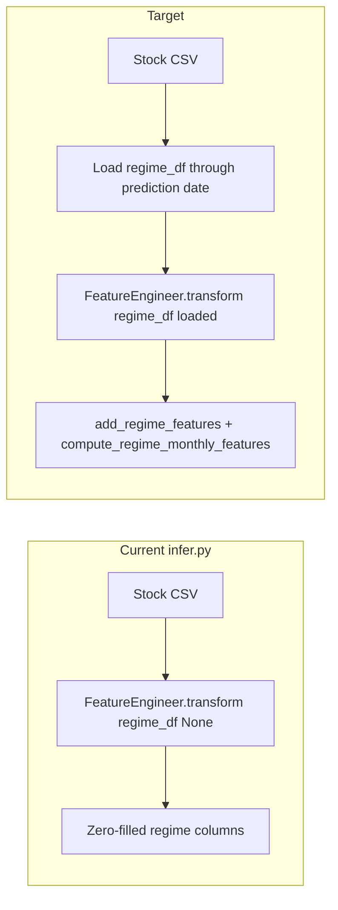

# Enable regime variables at inference (replace zero-fill)

## Current behavior

- In [`paper_trade/scripts/infer.py`](paper_trade/scripts/infer.py), features are built with:

```87:87:paper_trade/scripts/infer.py
    df = feature_engineer.transform(df, None, None, None)
```

- In [`mci_gru/features/registry.py`](mci_gru/features/registry.py), when `include_global_regime` is true and `regime_df` is missing and `regime_strict` is false, the code assigns **0.0** to every regime output column (e.g. `regime_global_score`, similarity features, subsequent-return features). That matches what [`paper_trade/Model/seed7_w_regime/run_metadata.json`](paper_trade/Model/seed7_w_regime/run_metadata.json) was trained on numerically, but **those values are not recomputed from macro data at inference**—so the regime head of the model sees a flat, uninformative input.

- Training loads regime inputs via [`mci_gru/data/data_manager.py`](mci_gru/data/data_manager.py) `DataManager.load_regime_inputs()` (called from [`mci_gru/pipeline.py`](mci_gru/pipeline.py)). **Inference will use the same function; the default path is FRED** (same as training when `regime_inputs_csv` is null): [`FREDLoader`](mci_gru/data/fred_loader.py) pulls yields, oil, VIX/volatility, SPX and copper where needed; [`load_regime_inputs`](mci_gru/data/data_manager.py) merges them and derives `regime_yield_curve`, `regime_monetary_policy`, `regime_stock_bond_corr`, etc.
- **Optional override:** If `regime_inputs_csv` is set in config, load from file instead (canonical schema in [`docs/REGIME_DATA_CONTRACT.md`](docs/REGIME_DATA_CONTRACT.md)). This is **not** the main plan for paper trade.
- **LSEG:** When `data.source == "lseg"`, existing code may supplement missing series from LSEG. Seed7 uses `data.source: csv` for stocks, so **FRED carries the primary regime inputs**; LSEG is only extra if you align config/source later.

## Critical design constraint: date range must cover inference

- `load_regime_inputs` uses `end = self.config.test_end` (see ~line 252 in `data_manager.py`). For [`paper_trade/Model/seed7_w_regime/config.yaml`](paper_trade/Model/seed7_w_regime/config.yaml), `test_end` is **2025-12-31**, while paper trading runs on **2026** dates. Any loader that reuses the YAML `test_end` without override would **not** fetch macro series through the live prediction date.
- **Required:** when building regime data for inference, set the effective end date to **`max(target_date, max(dt) in stock CSV)`** (and keep a long `start` history, same spirit as training: `train_start - 15y` is already used in `load_regime_inputs`).



## Primary data path: FRED API

- **Requirement:** `FRED_API_KEY` in the environment (same as training when not using a regime CSV).
- **Behavior:** With `regime_inputs_csv: null` (seed7 default), `load_regime_inputs` uses FRED series per existing logic; inference must call it with **`end` = prediction horizon**, not YAML `test_end`.
- **LSEG:** Secondary; only relevant if you run with `data.source: lseg` and want LSEG to fill gaps. Not required for the FRED-first plan on seed7.

## Recommended implementation path

### 1. Add a small inference-facing regime loader (avoid duplicating merge logic)

- **Option A (minimal surface area):** Add optional parameters to `DataManager.load_regime_inputs`, e.g. `end: Optional[str] = None` and `start: Optional[str] = None`, defaulting to current `self.config.test_end` / derived start when unset. Inference passes `end` = latest needed date.
- **Option B:** Extract a module-level function `load_regime_inputs_for_range(start, end, features_cfg, data_source, ...)` that contains the body of the current method and is called by both `DataManager` and `infer.py`.

Either way, **do not copy** `compute_regime_monthly_features` / merge logic into `infer.py`; keep a single path into `add_regime_features`.

### 2. Implement `prepare_inference_regime_df` in `infer.py` (or `mci_gru/data/inference_regime.py`)

- Inputs: merged `features` + `data` config (from [`load_config`](paper_trade/scripts/infer.py)), `target_date`, stock CSV max date.
- Logic (**FRED first**):
  - **Default (`regime_inputs_csv` null):** Build a [`DataConfig`](mci_gru/config.py) (or minimal object) with **`test_end` overridden** to the inference end date (`max(target_date, stock CSV max dt)`). Instantiate `DataManager` and call `load_regime_inputs` so the **FRED API path** runs (same as [`mci_gru/pipeline.py`](mci_gru/pipeline.py): pass LSEG RIC fields from `features` for optional LSEG supplementation when `source == "lseg"`).
  - **Override:** If `features.regime_inputs_csv` is set, resolve with [`resolve_project_data_path`](mci_gru/data/path_resolver.py) and load CSV (skip FRED for that run). Document as optional; not the default for paper trade.
- Respect **`regime_strict`**: if load fails and strict, fail fast; if not strict, match training fallback (warn + zeros) — already in pipeline pattern.

### 3. Pass `regime_df` into `transform`

- Replace `transform(df, None, None, None)` with `transform(df, None, None, regime_df)` when `include_global_regime` is true.
- When regime is disabled for a model, keep `None`.

### 4. Align `FeatureEngineer` flags with the checkpoint

- Ensure the dict passed to [`build_feature_engineer`](paper_trade/scripts/infer.py) includes **`regime_include_subsequent_returns`** and **`regime_subsequent_return_horizons`** consistent with [`run_metadata.json`](paper_trade/Model/seed7_w_regime/run_metadata.json) `feature_cols` (seed7 lists subsequent-return regime features). If YAML omits them, defaults in [`FeatureConfig`](mci_gru/config.py) (`regime_include_subsequent_returns: true`) already match; verify once when implementing.

### 5. Operational concerns (paper trade / nightly)

- **Required:** `FRED_API_KEY` for the default inference path. Ensure the nightly / catch-up environment (e.g. `lseg_env`) has it set if that is where `infer.py` runs.
- **LSEG:** Only needed for regime if you rely on `data.source == "lseg"` to supplement FRED gaps; seed7 stock data is `source: csv`, but FRED-only regime loading still works without LSEG for the main plan.
- **Optional CSV:** For offline or reproducibility, `regime_inputs_csv` can bypass FRED; not part of the primary design.

### 6. Verification

- **Unit-level:** Extend or add tests in [`tests/test_regime_features.py`](tests/test_regime_features.py) or a thin test that mocks a tiny `regime_df` and asserts `transform(..., regime_df=...)` produces **non-constant** regime columns for a fixed toy `df`.
- **Smoke:** Run `infer.py --date <latest>` with `FRED_API_KEY` set and confirm logged regime columns (or a one-line debug summary: mean/std of `regime_global_score` on prediction date) differ from all zeros.
- **No-lookahead sanity:** Confirm [`add_regime_features`](mci_gru/features/regime.py) continues to use `merge_asof` backward on monthly features (already documented there); optionally set `regime_enforce_lag_days: 1` in production configs if publication lag matters.

## Files likely touched

| Area | File |
|------|------|
| Inference | [`paper_trade/scripts/infer.py`](paper_trade/scripts/infer.py) |
| Regime loading | [`mci_gru/data/data_manager.py`](mci_gru/data/data_manager.py) (signature / `end` override) |
| Optional helper | New small module under `mci_gru/data/` *or* private helpers in `infer.py` only if kept tiny |
| Docs | [`docs/REGIME_DATA_CONTRACT.md`](docs/REGIME_DATA_CONTRACT.md) or [`README.md`](README.md) — only if you add a short “inference regime” subsection (skip if you prefer no doc churn) |
| Tests | [`tests/test_regime_features.py`](tests/test_regime_features.py) or new test file |

## Out of scope (unless you explicitly want it)

- Retraining or changing `graph_data.pt` / checkpoints.
- Changing the dynamic-graph plan in [`dynamic_graph_wiring_1842b591.plan.md`](dynamic_graph_wiring_1842b591.plan.md).
