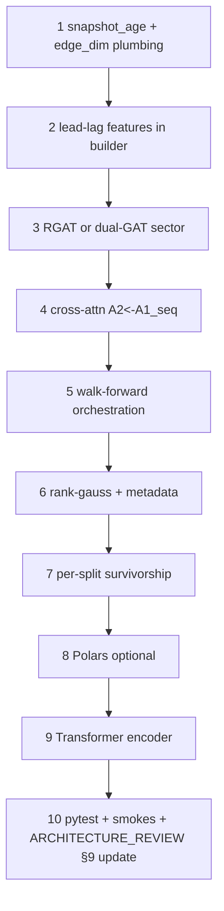

# Phase 3 — Fusion, Walk-Forward, Data & Graph Modernisation

**Source of truth:** [docs/ARCHITECTURE_REVIEW.md](../../../ARCHITECTURE_REVIEW.md) §9 Phase 3 bullets, TL;DR rows 1–2 and 4–5, §3.4 walk-forward gap, §8 table row 1, Phase 2 deferrals in Implementation status box.

**Relationship to Phase 2:** [`phase-2-trunk-surgery_a4da800c.plan.md`](phase-2-trunk-surgery_a4da800c.plan.md) shipped trunk regularisation, `nn.MultiheadAttention`, `GRUWithAttention`, DropEdge, group-type embed, output activation. Phase 3 picks up **cross-attention**, **walk-forward**, **Transformer encoder (optional)**, plus the **§9 Phase 3 data/graph** list.

## Goals (ranked by audit ROI)

1. **Cross-stream fusion** — `A2' = CrossAttn(Q=A2, KV=A1_full_seq)` so graph stream sees temporal sequence, not only same-day concat path ([ARCHITECTURE_REVIEW.md](docs/ARCHITECTURE_REVIEW.md) §2.3, §8 row 1).
2. **Walk-forward retraining** — rolling or expanding train/val/test (or train/val only + forward test), aggregated OOS metrics; complements embargo checks but does not replace them ([§3.4](docs/ARCHITECTURE_REVIEW.md)).
3. **Graph signal** — lead-lag edges (graph plan lever **2a**), **`snapshot_age_days`** as extra edge column ([§5.1](docs/ARCHITECTURE_REVIEW.md)), then **multi-relation** correlation + sector via `RGATConv` or equivalent ([§5.1](docs/ARCHITECTURE_REVIEW.md), graph plan **1b/2c**).
4. **Data / normalisation** — rank-gauss option ([§4.4](docs/ARCHITECTURE_REVIEW.md)); survivorship mitigation: per-split completeness → path to PIT universe ([§4.1](docs/ARCHITECTURE_REVIEW.md)); optional **Polars** behind flag for large universes ([§4.5](docs/ARCHITECTURE_REVIEW.md)).
5. **Optional temporal encoder** — `temporal_encoder: transformer` with causal mask ([§2.2](docs/ARCHITECTURE_REVIEW.md)); same `output_size` / `proj_temporal` contract as `gru_attn`.

**Explicitly lower priority in this phase (keep Phase 4 or parallel track):** gradient accumulation ([§3.1](docs/ARCHITECTURE_REVIEW.md)), FiLM on `R1/R2` ([§2.3](docs/ARCHITECTURE_REVIEW.md)), graph snapshot disk cache ([§5.3](docs/ARCHITECTURE_REVIEW.md)), block-bootstrap CIs / shared `portfolio.py` / Optuna / CI smoke ([§9 Phase 4](docs/ARCHITECTURE_REVIEW.md)).

## Invariants (do not regress)

- **7-tuple collate** — `edge_weight` remains `(E,)` legacy or `(E, F)` multi-feature; any new edge columns bump `F` consistently in `GATConv(..., edge_dim=F)`, collate, and tests ([AGENTS.md](../../../../AGENTS.md) invariant on tuple shape).
- **No lookahead** — graph snapshots, norm stats, labels, embargo semantics unchanged in spirit; walk-forward windows must respect same rules per window ([`no-lookahead.mdc`](../rules/no-lookahead.mdc)).
- **Paper-trade isolation** — `paper_trade/` still consumes frozen `graph_data.pt` / checkpoint path only; no training imports in inference bundle ([`paper-trade-isolation.mdc`](../rules/paper-trade-isolation.mdc)).
- **paper_faithful** — every new model/graph/data flag gets a **legacy pin** so replication configs stay bitwise-stable vs prior checkpoints where required (same pattern as Phase 2).

## Success criteria

- `python -m pytest tests/ -v` green after each merged slice.
- `python run_experiment.py +experiment=paper_faithful training.num_epochs=1 training.num_models=1` unchanged loss within tolerance vs pre–Phase-3 baseline (when all new flags pinned off).
- Dynamic graph smoke still runs with `graph.update_frequency_months>0` and multi-feature edges.
- New behaviour covered by unit tests: lead-lag toy correlation, walk-forward date parsing (no overlap violating embargo), cross-attn shape + gradient smoke.

## Workstreams and files

| Stream | Primary files |
|--------|----------------|
| Walk-forward | [run_experiment.py](run_experiment.py), [mci_gru/config.py](mci_gru/config.py), possibly [mci_gru/pipeline.py](mci_gru/pipeline.py) for window-scoped `prepare_data` |
| Cross-attention | [mci_gru/models/mci_gru.py](mci_gru/models/mci_gru.py) (`StockPredictionModel`), [mci_gru/config.py](mci_gru/config.py) |
| Graph builder | [mci_gru/graph/builder.py](mci_gru/graph/builder.py), [mci_gru/config.py](mci_gru/config.py) (`GraphConfig`) |
| GAT / relations | [mci_gru/models/mci_gru.py](mci_gru/models/mci_gru.py) (`GATBlock`), collate + [mci_gru/data/data_manager.py](mci_gru/data/data_manager.py) if relation type tensors needed |
| Rank-gauss / NaN | [mci_gru/data/preprocessing.py](mci_gru/data/preprocessing.py), [mci_gru/pipeline.py](mci_gru/pipeline.py) |
| Survivorship | [mci_gru/data/data_manager.py](mci_gru/data/data_manager.py) (`filter_complete_stocks` and call sites) |
| Polars | Feature modules under [mci_gru/features/](mci_gru/features/) or pipeline staging only |
| Transformer encoder | [mci_gru/models/mci_gru.py](mci_gru/models/mci_gru.py), `create_model` routing |

## Task detail

### 1. Walk-forward training loop

- **Config:** e.g. `training.walkforward.enabled`, `window_train_years`, `window_val_months`, `step_months`, `expanding` vs `rolling`, optional `max_windows`. Validate non-overlap with `label_t` + existing embargo expectations per window.
- **Orchestration:** Outer loop in `run_experiment.py`: for each window, set date overrides (Hydra-friendly struct) → `prepare_data` → train ensemble → log val/test metrics with `window_id` tag; persist **concatenated** OOS predictions or summary JSON for downstream Sharpe/IC (overlapping-return caveat in [§6.1](docs/ARCHITECTURE_REVIEW.md) remains).
- **MLflow:** parent run + child per window, or single run with nested params — pick one convention and document in [docs/ARCHITECTURE.md](docs/ARCHITECTURE.md) if needed.
- **Default:** `enabled: false` so current single-split behaviour unchanged.

### 2. Cross-attention `A2 ← A1_seq`

- **Data:** Temporal path must expose **sequence** of hidden states `(B, N, T, H)` (or last-layer outputs) before pooling to `A1`; today model may only keep final `A1` — extend return values behind a flag.
- **Module:** `nn.MultiheadAttention` with `Q` from `A2` candidate (post-`proj_cross` raw or aligned dim), `K,V` from flattened or per-stock `A1_seq`. Batch as `(B*N, ...)` to match existing patterns from Phase 2 MHA path.
- **Fusion point:** Replace or residual-add into stream feeding Part B GAT input: e.g. `A2_ctx = A2 + cross(A2, A1_seq)` (residual safer for ablation).
- **Flags:** `model.use_a1_a2_cross_attention` (default `false` until ablated), `model.cross_a2_num_heads`, dropout reuse `trunk_dropout` or separate field.
- **paper_faithful:** `use_a1_a2_cross_attention: false`.

### 3. `snapshot_age_days` edge feature

- At batch time, collate already knows sample `date` and snapshot `valid_from` from `GraphSchedule` — compute `age = (date - valid_from).days` (or trading-day delta if you standardise on business days) and broadcast to each edge as an extra column on `edge_attr`.
- **Alternative:** precompute per `(snapshot, trading_date)` in schedule build — heavier storage, simpler forward. Prefer **batch-time** if schedule stores only per-snapshot tensors.
- Extend `F` from 4 → 5 (or current `F`+1); update `paper_faithful` / scalar edge tests accordingly.

### 4. Lead–lag correlation edges (lever 2a)

- In `GraphBuilder.compute_correlation_matrix` (or parallel helper), for each pair `(i,j)` compute correlation of `r_i(t)` with `r_j(t+k)` for `k ∈ {1,2,3,5}` (and optionally reverse direction).
- **Edge construction:** Either augment same `edge_index` with lag-encoded features (preferred: fewer sparse structures) or separate relation (ties to RGAT task). Graph plan recommends storing **best lag** + strength as features.
- **Tests:** small synthetic returns where known lag produces higher corr at `k=2` than `k=0`.

### 5. Multi-relation graph (correlation + sector)

- **Sector edges:** static `same_sector` pairs (undirected) or industry code from metadata; cap degree (top-K within sector) if clique too dense.
- **Model:** `torch_geometric.nn.RGATConv` with `num_relations=2` (corr, sector) **or** two `GATConv` passes + `torch.cat` + linear fuse — second path avoids RGAT if PyG version friction; document choice.
- **Collate:** may need `edge_type` long tensor `(E,)` if RGAT requires; align with PyG API.
- **Flags:** `graph.use_sector_relation`, `graph.sector_column` (or external mapping file path).

### 6. Rank-gauss normalisation

- Add `DataConfig` / preprocessing flag: `normalisation: zscore | rank_gauss | both_pipeline` (pick one naming scheme).
- Fit **train window only**: per-feature or per-day ranks → Gaussian quantiles; persist transform params like current z-score stats for inference/paper_trade consistency.
- **Interaction with rank labels:** document semantics when `label_type=rank` to avoid double rank-warping if undesirable.

### 7. Survivorship and PIT universe

- **3a (simpler):** `filter_complete_stocks` requires completeness **per split** (train-only dates for train membership, etc.) instead of full calendar union; log `n_stocks` per split in `run_metadata.json` ([§4.1](docs/ARCHITECTURE_REVIEW.md) doc warning).
- **3b (heavier):** optional CSV of `kdcode` valid ranges (IPO, delist); filter rows by `dt`; delisting returns — only if data supports; gate behind `data.use_pit_universe`.

### 8. Polars (optional)

- Introduce `use_polars: bool` default `false`; implement hottest path (e.g. pivot / groupby in feature generation) in Polars with pandas in/out at boundaries to limit blast radius ([§4.5](docs/ARCHITECTURE_REVIEW.md)).

### 9. Transformer temporal encoder

- `ModelConfig.temporal_encoder: legacy | gru_attn | transformer` (validate set in `__post_init__`).
- `nn.TransformerEncoderLayer` + causal mask for length `his_t`; pool last position or attention pool to match `align_dim` / `proj_temporal` input.
- **paper_faithful:** pin `legacy` (or `gru_attn` only if you explicitly adopt paper-faithful temporal change — default stay `legacy` for strict replication).

## Execution order (recommended)

**Rationale:** edge tensor shape and `GATBlock.edge_dim` are shared dependencies — finish graph **features** first, then **relations**, then **model fusion** that assumes stable `A2` dims, then **walk-forward** (mostly orchestration), then **data transforms** (affect norms and masks), then **performance** (Polars) and **extra encoder** ablation.

## A/B and promotion gate

- Promote new defaults only after **paper_faithful delta** and at least one **walk-forward window set** show stable val IC / test IC vs Phase-2 baseline; Phase 4 **block-bootstrap** ([§6.2](docs/ARCHITECTURE_REVIEW.md)) strengthens claims but is not a hard blocker for merging flags default-off.

## Doc updates (close-out)

- [docs/ARCHITECTURE_REVIEW.md](docs/ARCHITECTURE_REVIEW.md): Implementation status box — add Phase 3 shipped bullets; §9 Phase 3 checklist checkboxes; remove stale "zero LayerNorm" prose in §2.1 if still contradictory (optional cleanup, same file only).

## Out of scope (Phase 4 or later)

- Block-bootstrap CIs, shared `portfolio.py`, Optuna, CI smoke, distribution-shift monitor ([§9 Phase 4](docs/ARCHITECTURE_REVIEW.md)).
- Graph disk cache ([§5.3](docs/ARCHITECTURE_REVIEW.md)).
- FiLM / global macro token refactor ([§2.3](docs/ARCHITECTURE_REVIEW.md)).
- Sharpe overlapping-window fix ([§6.1](docs/ARCHITECTURE_REVIEW.md)) — consider small doc fix in Phase 3 if walk-forward surfaces misleading Sharpe.
