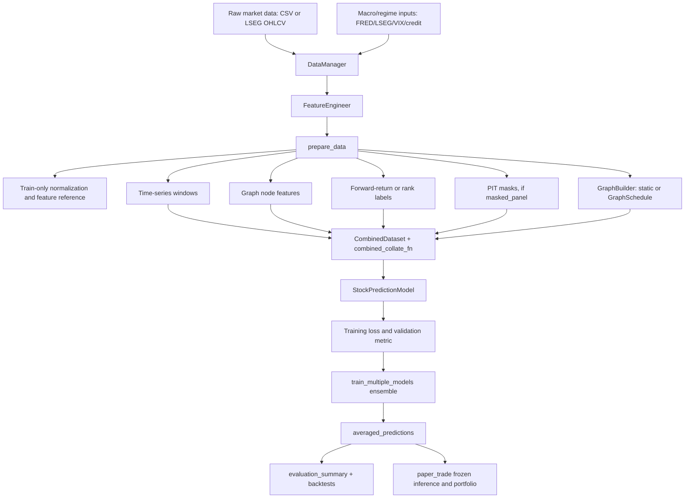
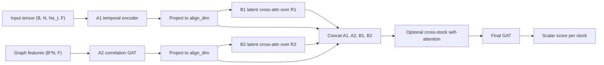
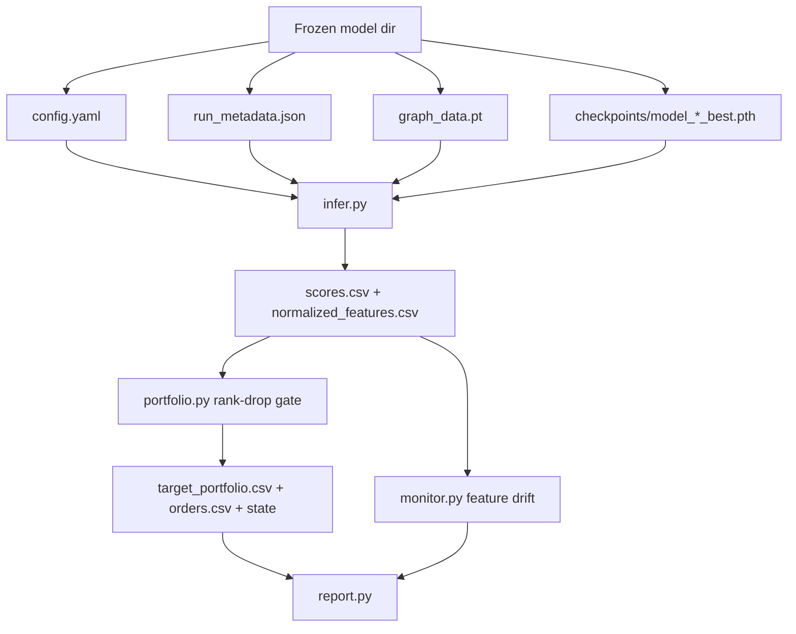

# MCI-GRU Program Map

Date: 2026-06-19

Purpose: provide a repo-grounded map of the MCI-GRU experiment system so model,
data, loss, graph, evaluation, and paper-trade changes can be researched without
losing the no-lookahead and PIT invariants.

Primary sources reviewed:

- `AGENTS.md`
- `docs/ARCHITECTURE.md`
- `docs/DEFAULT_EXPERIMENT_RECIPE.md`
- `docs/CONFIGURATION_GUIDE.md`
- `docs/TESTING_GUIDE.md`
- `docs/OUTPUT_MANAGEMENT.md`
- `docs/MLFLOW_TRACKING.md`
- `mci_gru/config.py`
- `mci_gru/pipeline.py`
- `mci_gru/data/data_manager.py`
- `mci_gru/data/preprocessing.py`
- `mci_gru/data/pit.py`
- `mci_gru/features/registry.py`
- `mci_gru/graph/builder.py`
- `mci_gru/graph/utils.py`
- `mci_gru/models/mci_gru.py`
- `mci_gru/training/losses.py`
- `mci_gru/training/trainer.py`
- `mci_gru/training/metrics.py`
- `mci_gru/evaluation/statistics.py`
- `mci_gru/evaluation/portfolio.py`
- `mci_gru/walkforward.py`
- `run_experiment.py`
- `paper_trade/scripts/infer.py`
- `paper_trade/scripts/portfolio.py`
- `paper_trade/scripts/monitor.py`
- `paper_trade/scripts/run_nightly.py`

## One-Page Flow

## Current Default Contract

The production-style confirmation recipe is the frozen recipe in
`docs/DEFAULT_EXPERIMENT_RECIPE.md`:

- Data: S&P 500-style cross-section, normally PIT for serious validation.
- Features: base plus momentum, weekly momentum, current-only global regime for
  confirmation runs.
- Graph: static Pearson threshold graph, `judge_value=0.8`, `top_k=0`,
  `use_multi_feature_edges=true`, `drop_edge_p=0.1`.
- Labels: raw 5-day forward returns, `model.label_t=5`.
- Objective: pure IC, `training.loss_type=ic`.
- Selection: `training.selection_metric=val_ic`.
- Training: 20 independent ensemble members, 100 epochs, patience 15, cosine LR.
- Paper-trade inference: uses frozen `run_metadata.json`, `config.yaml`,
  checkpoints, and `graph_data.pt`.

Treat deviations from that recipe as experiments, not silent new defaults.

## Component Map

| Layer | Current implementation | Primary tweak knobs | Guardrails |
| --- | --- | --- | --- |
| Data source and universe | `DataManager` loads CSV, LSEG, or index-level data. Universe configs live under `configs/data/`. | `data.source`, `data.universe`, `data.filename`, date ranges, `experiment_mode`, `index_filename`, PIT CSV. | Preserve temporal splits and label embargo. Serious S&P work should use true PIT masked-panel when testing cross-sectional claims. |
| PIT handling | `pipeline.prepare_data` can use legacy `row_filter` or true `masked_panel`. Masked panel keeps fixed union axis and carries `active_member`, `feature_ready`, `loss`, and `tradable` masks. | `data.use_pit_universe`, `data.pit_universe_csv`, `data.pit_universe_mode`, `pit_min_scoreable_stocks`, `pit_breadth_policy`. | Do not collapse masked-panel mode into complete-stock filtering. Losses and prediction export must ignore non-tradable/inactive names. |
| Feature engineering | `FeatureEngineer` applies base, momentum, volatility, volatility-targeting, VIX, credit, regime, RSI, MA, price, and volume features. | Feature config group, momentum encoding/blend, volatility-targeting components, regime strictness/windows, VIX/credit toggles. | Feature additions should be point-in-time and trailing-window only. Regime strict mode should fail rather than silently zero-fill for confirmation runs. |
| Normalization | `pipeline` computes z-score stats from training dates only, or rank-Gaussian references from training values only. It writes feature drift reference data. | `data.normalisation=zscore|rank_gauss`, feature list, train window. | Never fit normalization on val/test. Preserve `run_metadata.json` stats for inference parity. |
| Labels | `compute_labels` uses `close[t + label_t] / close[t + 1] - 1`; optional rank labels are same-day cross-sectional percentiles. | `model.label_t`, `training.label_type=returns|rank`. | Keep embargo gaps greater than `label_t`. In masked PIT mode, unobservable labels stay NaN and are masked out. |
| Tensor construction | Time-series tensor is `(days, stocks, his_t, features)`; graph feature tensor is `(days, stocks, features)`; labels are `(days, stocks)`. | `model.his_t`, feature set, data window, `data.use_polars`. | Keep time-series, graph features, labels, dates, and PIT masks aligned by label date. |
| Correlation graph | `GraphBuilder` builds Pearson return graphs from past data before `valid_from`. Static mode builds once; dynamic mode precomputes `GraphSchedule`. | `judge_value`, `top_k`, `top_k_metric`, `corr_lookback_days`, `update_frequency_months`, `use_multi_feature_edges`, lead-lag, snapshot age, sector relation. | Dynamic graph snapshots must use data strictly before the sample date. `edge_feature_dim` in the model must match collated edge attributes. |
| DataLoader/collate | `CombinedDataset` and `combined_collate_fn` produce the 9-tuple consumed by `Trainer`; collate handles graph schedule, snapshot-age column, PIT edge filtering, and sector edges. | Batch size, shuffle policy, append snapshot age, sector relation, dynamic graph. | Preserve the 9-tuple contract. Do not let inactive PIT nodes send graph messages. |
| Model | `StockPredictionModel` combines temporal A1, graph A2, latent B1/B2 cross-attention, optional self-attention, and final GAT. | Temporal encoder, multi-scale on/off, hidden sizes, GAT heads/sizes, latent states, self-attention, trunk regularization, sector branch, A1-A2 cross-attention. | Output shape must remain `(batch, stocks)`. Stock masks must zero inactive nodes through temporal, graph, attention, and output paths. |
| Losses | `MaskedMSELoss`, `ICLoss`, `CombinedMSEICLoss`, `PortfolioICLoss`, and `LambdaRankICLoss` are selected by `build_training_loss`. | `loss_type`, `ic_loss_alpha`, `portfolio_ic_*`, `lambdarank_ic_*`, label type, selection metric. | Losses must operate on finite same-day valid names only. Portfolio/path-dependent objectives need extra leakage review before promotion. |
| Training loop | `Trainer` uses AdamW, gradient clipping, optional AMP, optional cosine scheduler with warmup, early stopping by val loss/IC/rank IC, and checkpointing. | LR, weight decay, gradient clip, scheduler, warmup, epochs, patience, batch size, AMP, `selection_metric`. | Checkpoint metric must match the experiment claim. Validation metrics are per rankable day, not raw element counts. |
| Ensemble | `train_multiple_models` trains `num_models` independent models using `seed + model_id`, saves per-model predictions, and averages scores. | `training.num_models`, base `seed`, checkpoint retention, tracking. | Ensemble averaging is the prediction contract; do not compare a single member against ensemble baselines as if equivalent. |
| Walk-forward | `mci_gru/walkforward.py` rewrites train/val/test windows with embargo-valid rolling or expanding windows. | Window years/months, step months, expanding vs rolling, max windows. | Generated windows must pass `ExperimentConfig` embargo validation. |
| Evaluation | `evaluate_predictions` reports MSE/MAE, Pearson IC, Spearman rank IC, top-k returns, Newey-West Sharpe, and bootstrap CIs. | `evaluation.top_k_values`, bootstrap settings, CI level, block size, Newey-West lags. | Use NaN-aware valid masks. For overlapping labels, prefer Newey-West or block bootstrap evidence. |
| Backtesting | Backtest scripts under `tests/` evaluate saved predictions, transaction costs, rank-drop gates, and PIT variants. | Top-k, holding period/rebalance style, transaction costs, rank-drop gate, no-gate replay, label horizon. | Timing fairness matters: prediction date, executable date, and return attribution must be explicit. |
| Paper trading | `paper_trade/scripts/infer.py` loads frozen metadata/checkpoints/graph data; `portfolio.py` applies the rank-drop gate; `monitor.py` writes drift outputs; `run_nightly.py` orchestrates. | Frozen model directory, score date, top-k, min rank drop, drift thresholds/reference. | Paper-trade inference must not import or call `GraphBuilder`; it uses frozen `graph_data.pt`. |
| Outputs and tracking | Hydra writes run folders; MLflow is additive. Filesystem artifacts remain source of truth for inference. | `output_dir`, `experiment_name`, tracking flags, artifact logging. | Keep `config.yaml`, `run_metadata.json`, `graph_data.pt`, checkpoints, and predictions together for reproducible inference. |

## Model Architecture Map

### A1: Temporal Stream

Source: `mci_gru/models/mci_gru.py`

Current options:

- `MultiScaleTemporalEncoder`: fast path plus slow Conv1d -> recurrent path.
- `GRUWithAttention`: fused `nn.GRU` plus attention readout.
- `ImprovedGRU`: original attention-reset GRU cell.
- `CausalTransformerEncoder`: optional transformer temporal path.

Research knobs:

- `model.his_t`
- `model.gru_hidden_sizes`
- `model.use_multi_scale`
- `model.temporal_encoder`
- `model.slow_kernel`
- `model.slow_stride`
- `model.use_a1_a2_cross_attention`

Watchpoints:

- Longer histories can reduce sample count and increase memory.
- Transformer or cross-stream attention should be checked for causal masks and
  shape compatibility.

### A2: Cross-Sectional Graph Stream

Source: `mci_gru/models/mci_gru.py`, `mci_gru/graph/builder.py`

Current options:

- Correlation GAT over the graph built from return correlations.
- Optional sector branch with dual GAT plus fusion.
- Train-time edge dropout.

Research knobs:

- `graph.judge_value`
- `graph.top_k`
- `graph.top_k_metric`
- `graph.update_frequency_months`
- `graph.corr_lookback_days`
- `graph.use_multi_feature_edges`
- `graph.use_lead_lag_features`
- `graph.append_snapshot_age_days`
- `graph.use_sector_relation`
- `graph.drop_edge_p`
- GAT heads and hidden sizes.

Watchpoints:

- `run_experiment.py` derives `edge_feature_dim` from graph config. Any new
  edge attribute column needs `mci_gru/graph/utils.py` and inference parity.
- Static paper-trade graph data is saved once; dynamic research does not
  automatically mean live paper-trade dynamic inference.

### B1/B2: Latent Market State

Source: `MarketLatentStateLearner`

Current behavior:

- Learned latent vectors `R1` and `R2`.
- Cross-attention maps A1 and A2 streams into latent market context.

Research knobs:

- `model.num_hidden_states`
- `model.cross_attn_heads`
- `model.latent_init_scale`
- `model.use_nn_multihead_attention`
- `model.trunk_dropout`

Watchpoints:

- Head counts must divide feature dimensions.
- Large latent state counts increase parameters across every stock-date batch.

### Fusion and Prediction Head

Current behavior:

- Concatenate `[A1, A2, B1, B2]`.
- Optional `SelfAttention` across stocks with optional group-type embedding.
- Final GAT produces one scalar score per stock.

Research knobs:

- `model.use_self_attention`
- `model.use_group_type_embed`
- `model.use_trunk_regularisation`
- `model.trunk_dropout`
- `model.hidden_size_gat2`
- `model.output_activation`

Watchpoints:

- The stream order `[A1, A2, B1, B2]` is part of the type-embedding contract.
- Final activation should match loss/label scale. The frozen recipe uses raw
  scores, not sigmoid probabilities.

## Data and Feature Research Surfaces

### Universe and Data

Possible research:

- Compare legacy complete-stock filtering against true PIT masked-panel.
- Test S&P 500 vs Russell 1000 vs index-level mode.
- Test longer training histories and walk-forward windows.
- Quantify LSEG coverage, alias coverage, and PIT breadth before training.

Useful knobs:

- `data.source`
- `data.universe`
- `data.train_start`, `train_end`, `val_start`, `val_end`, `test_start`, `test_end`
- `data.experiment_mode`
- `data.filter_stocks_per_split`
- `data.use_pit_universe`
- `data.pit_universe_mode`

Preferred evidence:

- PIT breadth diagnostics in `run_metadata.json`.
- Alias/progression audits under `docs/` and tests.
- Comparisons against a fixed frozen recipe.

### Feature Families

Possible research:

- Momentum encoding: binary vs continuous vs buffered.
- Momentum blend: static equal blend vs dynamic cycle-aware blend.
- Weekly momentum on/off.
- Volatility-only vs volatility-targeting features.
- VIX/credit/regime feature ablations.
- Regime current-only vs subsequent-return regime features.
- Rank-Gaussian normalization vs z-score.

Useful knobs:

- `features.include_momentum`
- `features.include_weekly_momentum`
- `features.momentum_encoding`
- `features.momentum_blend_mode`
- `features.include_volatility`
- `features.include_volatility_targeting`
- `features.volatility_targeting_components`
- `features.include_vix`
- `features.include_credit_spread`
- `features.include_global_regime`
- `features.regime_*`
- `data.normalisation`

Preferred evidence:

- One-factor-at-a-time ablations against the frozen recipe.
- Synthetic no-lookahead tests for any feature with rolling windows, shifts, or
  external series joins.

## Graph Research Surfaces

Possible research:

- Static threshold vs dynamic graph schedule.
- Global threshold vs per-node top-K.
- Positive-only top-K (`corr`) vs signed magnitude top-K (`abs_corr`).
- Multi-feature edges vs scalar correlation.
- Lead-lag features and snapshot age.
- Sector relation branch.
- Graph update cadence and correlation lookback.
- Edge dropout.

Useful knobs:

- `graph.update_frequency_months`
- `graph.corr_lookback_days`
- `graph.judge_value`
- `graph.top_k`
- `graph.top_k_metric`
- `graph.use_multi_feature_edges`
- `graph.use_lead_lag_features`
- `graph.lead_lag_days`
- `graph.append_snapshot_age_days`
- `graph.use_sector_relation`
- `graph.drop_edge_p`

Preferred evidence:

- `scripts/diagnose_dynamic_graph.py` for edge counts/snapshot behavior.
- Focused tests in `tests/test_dynamic_graph_updates.py` and
  `tests/test_phase3_graph_and_walkforward.py`.
- Frozen recipe comparison where graph is the only changed factor.

## Objective and Selection Research Surfaces

Current loss options:

- `mse`: masked elementwise MSE.
- `ic`: negative same-day Pearson IC.
- `combined`: MSE plus IC blend.
- `portfolio_ic`: IC plus differentiable soft top-k forward-return utility.
- `lambdarank_ic`: same-day pairwise LambdaRankIC-style surrogate with capped
  deterministic pairs and Spearman-oriented weighting.

Useful knobs:

- `training.loss_type`
- `training.ic_loss_alpha`
- `training.portfolio_ic_top_k`
- `training.portfolio_ic_weight`
- `training.portfolio_ic_temperature`
- `training.lambdarank_ic_max_pairs_per_day`
- `training.lambdarank_ic_temperature`
- `training.selection_metric`
- `training.label_type`

Current interpretation:

- The conservative launch default remains `loss_type=ic`,
  `selection_metric=val_ic`, raw return labels.
- `lambdarank_ic` is the cleaner rank-loss experiment path when optimizing rank
  IC directly.
- `portfolio_ic` is closer to trading utility, but its backtest relationship and
  rank-drop gate interactions require more careful validation.

Watchpoints:

- Loss functions see only predictions and labels, not prices or dates. That is
  a useful anti-leakage property.
- Path-dependent losses such as Sharpe, drawdown, turnover, or optimizer-layer
  portfolio objectives would need a new data contract and timing audit.

## Training and Evaluation Research Surfaces

Possible research:

- Ensemble size vs variance and compute cost.
- Batch size and shuffle behavior, especially static vs dynamic graph.
- Learning-rate schedule and warmup.
- Early-stopping metric: val IC vs val rank IC vs val loss.
- Walk-forward rolling vs expanding windows.
- Top-k evaluation breadths.
- Bootstrap and Newey-West confidence settings.
- Saved-prediction report and no-rank-gate replays.

Useful knobs:

- `training.num_models`
- `training.num_epochs`
- `training.batch_size`
- `training.learning_rate`
- `training.weight_decay`
- `training.gradient_clip`
- `training.lr_scheduler`
- `training.warmup_steps`
- `training.shuffle_train`
- `training.walkforward.*`
- `evaluation.top_k_values`
- `evaluation.bootstrap_*`
- `evaluation.sharpe_method`

Preferred evidence:

- `training_summary.json` for validation objective.
- `evaluation_summary.json` for IC/rank IC/top-k metrics.
- Backtest outputs for execution-aware returns.
- MLflow only as an index; filesystem run folders remain the source of truth.

## Paper-Trade Map

Paper-trade invariants:

- Do not call `GraphBuilder` in paper-trade inference.
- Use training `norm_means`, `norm_stds`, `feature_cols`, `kdcode_list`, and
  saved graph data from the frozen run.
- Keep normalized inference features available for drift monitoring.
- Rank-drop gate behavior should stay shared with backtest logic.

## Research Queue Suggestions

Near-term, lower-risk:

1. Graph ablation ladder: frozen recipe -> top-K positive -> top-K absolute ->
   dynamic top-K -> lead-lag/snapshot-age.
2. LambdaRankIC PIT validation: compare pure IC vs LambdaRankIC with
   `selection_metric=val_rank_ic` on the same PIT years.
3. Feature ablation ladder: momentum baseline -> current-only regime -> vol
   targeting -> credit/VIX, one family at a time.
4. Label horizon sweep: `label_t=1,5,10,21` with matching embargo and evaluation
   assumptions.
5. Walk-forward stability: same recipe over rolling windows, reporting mean and
   dispersion across windows.

Medium-risk:

1. Temporal encoder variants: `gru_attn` vs legacy vs transformer, holding graph
   and loss fixed.
2. Sector relation branch with a verified sector map and edge-feature parity.
3. Rank-Gaussian normalization with saved inference references and drift checks.
4. A1/A2 cross-attention for graph-aware temporal fusion.

Higher-risk, design-first:

1. Uncertainty-adjusted ranking using ensemble disagreement.
2. Distributional alpha heads.
3. Sharpe/drawdown/turnover-aware path losses.
4. Optimizer-layer portfolio objectives.
5. Dynamic or adaptive live paper-trade graph updates.

## Change Checklist

Before changing a model-relevant component:

- Identify which layer this changes: data, feature, label, graph, model, loss,
  training, evaluation, backtest, or paper-trade.
- Keep the frozen recipe unchanged unless the change is explicitly a new default.
- Check whether the change affects `run_metadata.json`, `graph_data.pt`,
  `feature_reference.json`, prediction CSV shape, or paper-trade inference.
- Preserve the 9-tuple DataLoader contract.
- Preserve PIT masked-panel breadth and masks.
- Preserve train-only normalization and graph/label timing.
- Add or update a focused no-lookahead test if the change uses dates, rolling
  windows, shifts, external macro data, graph snapshots, labels, or masks.
- For new graph edge attributes, update `edge_feature_dim` and inference parity.
- For new losses, verify finite-mask behavior and same-day cross-sectional scope.
- For backtest changes, state exact prediction time, trade time, holding period,
  transaction costs, and return attribution.
